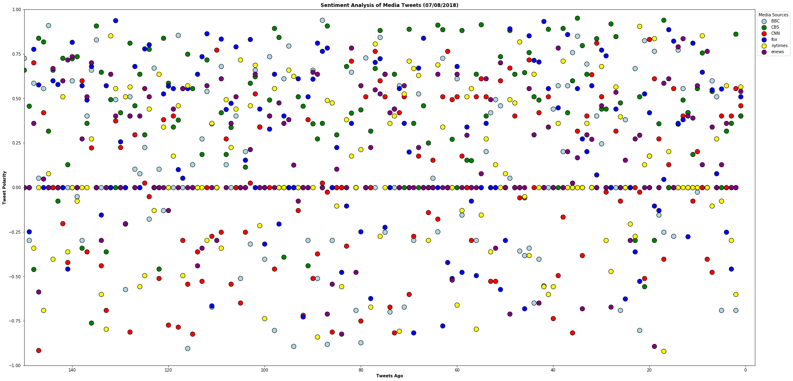
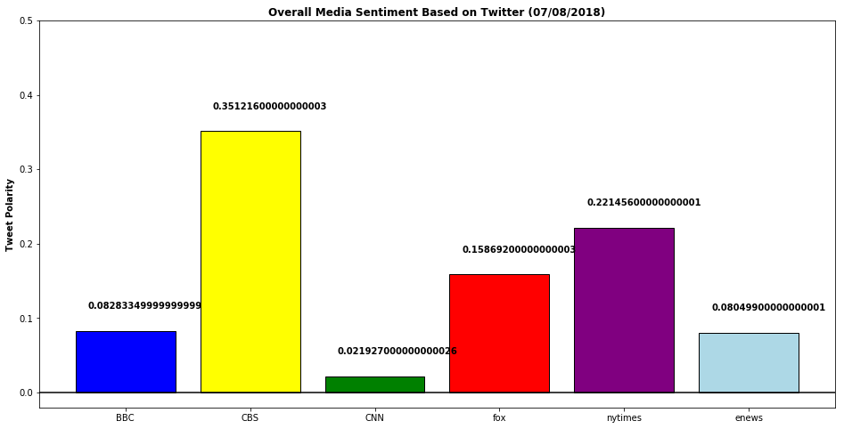

3 Trends by Caroline Teti

1) CNN's twitter handle is overall closest to 0 or negative polarity (at time of search, compound score is 0.158692).
2) CBS's twitter handle tweets are overall: roughly 35% positive (+1) while world news: BBC falls at 10% and CNN at 0%. 
3) NY times' compound score or tweet sentiment is more positive than enews or fox news during this search. 


```python
# Setting Dependencies
import tweepy
import json
import pandas as pd
import numpy as np
import time

import matplotlib.pyplot as plt

# For Sentiment Analysis
from vaderSentiment.vaderSentiment import SentimentIntensityAnalyzer
analyzer = SentimentIntensityAnalyzer()
```


```python
# Twitter API Keys
from config import (consumer_key, 
                    consumer_secret, 
                    access_token, 
                    access_token_secret)

# Setup Tweepy API Authentication

auth = tweepy.OAuthHandler(consumer_key, consumer_secret)
auth.set_access_token(access_token, access_token_secret)
api = tweepy.API(auth, parser = tweepy.parsers.JSONParser())
```


```python
# Set up handles/usernames of news sources for tweets
# Set up counter for loop
# Set up array for storage of info
news_handle = ["@BBC", "@CBS", "@CNN", "@fox", "@nytimes","@enews"]
counter = 1
sentiments = []
```


```python
# Looping through 200 most recent tweets and running sentiment analysis
for handle in news_handle:
    public_tweets = api.user_timeline(handle, count = 200)
    tweetnumber = 1       
    for tweet in public_tweets:
        print("Tweet %s: %s" % (counter, tweet["text"]))
        compound = analyzer.polarity_scores(tweet["text"])["compound"]
        pos = analyzer.polarity_scores(tweet["text"])["pos"]
        neu = analyzer.polarity_scores(tweet["text"])["neu"]
        neg = analyzer.polarity_scores(tweet["text"])["neg"]
        tweets_ago = tweetnumber
        sentiments.append({"Media Source": handle,
                           "Text":tweet["text"],
                           "Date": tweet["created_at"],
                           "Compound": compound,
                           "Positive": pos,
                           "Neutral": neu,
                           "Negative": neg,
                           "Tweet Count": tweetnumber})
        tweetnumber +=1
        counter +=1
```

    Tweet 1: Justin Bieber 'engaged to Hailey Baldwin', US media say. 👉 https://t.co/j8cKfq8AtD https://t.co/HkqnZAQJi4
    Tweet 2: RT @BBCBreaking: UK police launch murder inquiry after Dawn Sturgess, 44, dies after exposure to nerve agent Novichok https://t.co/adk3o7Sj…
    Tweet 3: ✊🛍🛒 This family have changed their shopping habits to reduce their plastic footprint.
    #PlasticsAction https://t.co/RL3U1Vk7EN
    Tweet 4: ❤️ This man is cleaning all 388 Holocaust plaques in his city. https://t.co/AfdxFBxxJ4
    Tweet 5: 'Did air pollution kill my daughter?' https://t.co/XzWSWFga6S
    Tweet 6: The operation to free 12 boys and their coach from a cave in northern Thailand is running "smoothly", the head of t… https://t.co/fbCN1JeN1K
    Tweet 7: 🎶🎻✨ Tonight, @thekatiederham introduces 2018's open-air concert from the magnificent gardens of the Schonbrunn Pala… https://t.co/AHAYPRtAJn
    Tweet 8: Look back at the 2008 #Wimbledon final between @rogerfederer and @RafaelNadal, widely acknowledged as one of the gr… https://t.co/bNcdnjna2s
    Tweet 9: ⚡️ This 15-year-old inventor is bringing cheap electricity to the developing world. 
    (via @BBCThree) https://t.co/UWVzHhRs12
    Tweet 10: RT @BBCWorld: Nine boys and their coach will spend another night trapped in Thai cave, as rescue operation is paused for at least 10 hours…
    Tweet 11: 🍄 Increasingly, scientists are looking at whether some mind-altering drugs might also have the potential to be mind… https://t.co/srd1w793nY
    Tweet 12: RT @BBCNews: First boys 'rescued from Thailand cave' https://t.co/86U00UcvHn
    Tweet 13: The remarkable Viking discovery on the Isle of Skye. https://t.co/QV4CIcIO9L
    Tweet 14: "Y'alright love?"
    
    😂 This crow has a Yorkshire accent and it's amazing. https://t.co/3J8BQGiZM7
    Tweet 15: Whether your whole household is vegetarian or you're just trying to cut down on your meat intake, everyone will lov… https://t.co/mvwy1TIacc
    Tweet 16: These little eels have travelled all the way from near the Bahamas to Scotland. https://t.co/P1oXYtSXD1
    Tweet 17: 😳🏝 Still haunted by the image of Pierce Brosnan dancing in flippers? Well, he’s back. 
    
    🎥🍿 These are the nine films… https://t.co/Xw6O9UYha4
    Tweet 18: RT @bbc5live: Just in case you missed this last night on @bbc5live 
    
    28 years on from Italia 90, @chriswaddle93 gets emotional as England m…
    Tweet 19: RT @BBCWorld: Hang on boys, rescue is coming. 🐗🇹🇭
    
    The mission to rescue 12 boys and football coach from a cave in Thailand has begun - and…
    Tweet 20: RT @BBCFood: 7 recipes for all the gluten-free people deciding what to have to breakfast 🤷‍♀
    https://t.co/vP56pf2KB1 https://t.co/zwNCvt0kKr
    Tweet 21: RT @BBCBreakfast: Everyone needs this delicious dose of doggy cuteness 😍😍 https://t.co/Bq4AebzsRy
    Tweet 22: RT @BBCNewsNI: Motorcycle racer William Dunlop killed in a crash at the Skerries 100 road races https://t.co/6m5CFDY1Jp https://t.co/53B15j…
    Tweet 23: 😍🏝 Paradise is on our doorstep!  https://t.co/BWrCJcIzHl
    Tweet 24: 'You don't look autistic' and other things not to say to people with autism. https://t.co/1GQS1Icvms
    Tweet 25: A South African woman is recovering in hospital after being discovered alive in a mortuary fridge.
    👉… https://t.co/IhrhDG1W2A
    Tweet 26: The women paid to cry at the funerals of strangers. https://t.co/oF6wA0ecwI
    Tweet 27: These are the nine TV shows you NEED to watch in July. ☀️📺🌡 https://t.co/p1pIcjGKap https://t.co/QCXpJOUav1
    Tweet 28: What a moment! ️⚽️👏
    
    England are into the #WorldCup semi-finals for the first time since 1990. 👉… https://t.co/jCgcFi9kjg
    Tweet 29: RT @BBCSport: Hey Zlatan... you owe David Beckham dinner! 😉 #ENGSWE #bbcworldcup #ThreeLions https://t.co/Kf8auWDumI
    Tweet 30: RT @BBCSport: THEY'VE DONE IT!
    
    England have reached a #WorldCup semi-final for the first time since 1990!
    
    FT: #SWE 0-2 #ENG 
    
    Reaction:
    📺…
    Tweet 31: 🖼 How can virtual reality help visually impaired people 'see' art? https://t.co/9Ry7wblTsn
    Tweet 32: BREAKING: News just in on the #Poldark set... 
    
    #ENGSWE #ENG #WorldCup 
    
    https://t.co/SXiXO99gi4
    Tweet 33: 😍🖼 10-year-old Kareem is an OUTSTANDING artist. https://t.co/Ip4X0w1dpc
    Tweet 34: Can the #ThreeLions go one step further? Today England face Sweden in the #WorldCup quarter-finals. #ENGSWE
    
    Englan… https://t.co/z7uo1UoVvR
    Tweet 35: RT @BBCOne: To all the Delias out there, we hope you find your Patsy. Happy Pride! 🌈 #Pride2018 https://t.co/uBSjFODU1S
    Tweet 36: RT @bbcthree: This Amazing Human uses coffee to give homeless people a second chance. https://t.co/NkhLSn6KTB
    Tweet 37: One. Step. Closer. ️⚽️➡️🏠
    
    Here's what could happen if @England won the #WorldCup... 
    
    #ENGSWE #ENG #ThreeLions
    
    https://t.co/XXqMRopNvK
    Tweet 38: Scientists have designed a special type of drug that helps the body eat and destroy cancerous cells.
    👉… https://t.co/0kv12B5SRu
    Tweet 39: From vegetarian chilli to truffle pots: celebrate #WolrdChocolateDay in style with these recipes from @BBCFood. 😍🍫… https://t.co/mlGEbp1WII
    Tweet 40: 😂 #Wimbledon has started and suddenly EVERYONE is a tennis expert. https://t.co/TYjCmdDXxP
    Tweet 41: 🏃🏻‍♂️ Take a #parkour tour of Glasgow with Scotland's @RobbieJGriffith. https://t.co/SlvAKocTJ2
    Tweet 42: RT @BBCSport: Stop EVERYTHING you are doing! ✋✋✋
    
    Cancel your wedding! 👰
    Don't go shopping! 🛍
    The holiday can wait! ✈️
    Forget that first da…
    Tweet 43: RT @bbceastenders: “I realised what an important story it was to tell.”
    @Bonnie_Langford and @DavoodGhadami discuss the knife crime storyli…
    Tweet 44: RT @BBCNews: Steve Ditko: Spider-Man co-creator found dead at 90 https://t.co/Epd0LTJUKP
    Tweet 45: Seven years after her death, these previously unseen photographs show Amy Winehouse at ease in front of her friend'… https://t.co/bYoqpBhIeV
    Tweet 46: Yassine scavenged on the dump for eight years. Now he runs it. 
    
    https://t.co/gUOhlrkv6P
    Tweet 47: 😺🐾 They sweat through their paws and can't taste sweet things... 
    
    16 things you never knew about cats 👉… https://t.co/IOfDUpm49v
    Tweet 48: 🎶 It's coming home 🎶
    
    @Baddiel and @FrankOnTheRadio's song is sweeping the nation (again!)
    
    Here's the story of how… https://t.co/FTaRd9YNiZ
    Tweet 49: 😂 How annoying is this? https://t.co/Z2vtjhPZXH
    Tweet 50: 😲🐻 A new study reveals the hidden history of brown bears in Britain, suggesting they still roamed wild 1,500 years… https://t.co/MdvCpNLZHr
    Tweet 51: RT @BBCOne: Sherlock is ALL the goals on #InternationalKissingDay 😍
    #Sherlock #BBCSherlock https://t.co/yTcpX43pg7
    Tweet 52: Actual footage of me leaving the office at exactly 5pm... 👋 #FridayFeeling https://t.co/no9vchzANY
    Tweet 53: RT @BBCCiN: Thank you to everyone who got involved, fundraised and donated to BBC Children in Need last year! You have helped us to raise £…
    Tweet 54: A man had to be rescued by firefighters after he became stuck in melted tarmac in Newcastle. 😰🌡🚒… https://t.co/Vv4Gk8hhuH
    Tweet 55: RT @bbcpress: ‘Painfully funny’ bestseller #ThisIsGoingToHurt by @amateuradam to be adapted as eight-part @BBCTwo comedy-drama: https://t.c…
    Tweet 56: 💵👟 A disintegrating trainer worn by Michael J Fox in the Back to the Future sequel has sold for $92,100 (£70,143).… https://t.co/NOGE8qFug2
    Tweet 57: 🐝🕺🐝 We all know someone who does the wasp dance. https://t.co/IJm0eTScUS
    Tweet 58: Beer glasses have been seized from a restaurant chain in Birmingham after they were found to be too small to contai… https://t.co/qzSLHjzuLO
    Tweet 59: RT @BBCBreaking: Thai cave rescue death:
    
    - Diver named as Saman Kunan
    - 'His job was to deliver oxygen, did not have enough on his way bac…
    Tweet 60: RT @BBCRadio2: "I think you and @Pink are the top end of the rock and roll ladies, and keep at it!" - @flo_tweet was truly touched by this…
    Tweet 61: RT @BBCSport: "I'm not David Beckham, so we're in trouble." 
    
    Gareth Southgate's reaction to his new-found status as a style icon. https://…
    Tweet 62: RT @CBeebiesHQ: Long before @WaffleWonderDog, we had Pippin 🐶🐶
    
    Hands up if you remember Come Outside 🙋‍♂️🙋
    
    #CBeebiesNostalgia 
    #Throwback…
    Tweet 63: RT @BBCRadio3: A rare chance to hear this monumental, modern masterpiece.
    Gruppen - Stockhausen's avant-garde work for three orchestras fro…
    Tweet 64: RT @5liveSport: "You should get a red card if you fake it!" 🔴
    
    John McEnroe doesn't hold on when giving his thoughts on VAR and 'the guy fr…
    Tweet 65: 💕🎈 Georgina is 96-years-old and organises parties to help combat loneliness. https://t.co/JRAkMDNny8
    Tweet 66: Why does alcohol affect women more than men?
    👉 https://t.co/UNwg06vOl3 https://t.co/HBR4lEMGXV
    Tweet 67: 😂🐶🎨 But your dog probably wouldn't sit still long enough for this, right? https://t.co/U2Mdq3bOda
    Tweet 68: Social media companies are deliberately addicting users to their products for financial gain, say Silicon Valley in… https://t.co/5Vn7t2h1SF
    Tweet 69: The town where even the graves are bulletproof. https://t.co/MDyzEuNg3y
    Tweet 70: 🎓📚 A Belgian boy has graduated secondary school aged eight after completing six years' study in just a year and a h… https://t.co/eStTYhpek8
    Tweet 71: In South Africa, three women are killed by their partners every day. https://t.co/Vg7jDZJgU6
    Tweet 72: RT @BBCNewsPR: Watch the evolution of our evening news jingles as we celebrate the 64th anniversary of BBC TV News. Show your age, which on…
    Tweet 73: RT @bbceastenders: It's coming home. #ENG https://t.co/Dp1R1SVjB4
    Tweet 74: At least two suspected rhino poachers have been mauled to death and eaten by lions on a South African game reserve,… https://t.co/m8V0TpFjsd
    Tweet 75: 🌡🔥☀️From strength to bad breath: these are the weird things that happen to your body in extreme heat. 👉… https://t.co/sSsoIgrD5S
    Tweet 76: 😍💗 Wouldn't the world be a better place if more people were kind like this? https://t.co/2v0UXIcXN8
    Tweet 77: 🛍🛒 Is it possible to shop without buying plastic?
    #PlasticsAction https://t.co/nV0kMA6UzE
    Tweet 78: RT @bbcstories: Indian-born Dennis Moss was inspired by tragedy to join the Welsh Ambulance Service in 1976 - and he's still working there…
    Tweet 79: RT @bbcthesocial: Go to a festival without destroying the planet 🌍
    
    (you might need to ditch the glitter) https://t.co/RnlRy4lwjC
    Tweet 80: RT @bbcthree: Jack tragically died whilst playing the choking game. Now his mum wants to warn other YouTubers before it's too late. https:/…
    Tweet 81: RT @BBCNews: "We knew we didn't have to be frightened of being ill"
    
    Beryl had life-saving treatment on the NHS just weeks after it began #…
    Tweet 82: RT @BBCWales: Staff from across the #NHS in Wales come together to create a one-off #NHSLipSync of Jess Glynne's song Hold My Hand for #NHS…
    Tweet 83: From a true-crime tale of 1930s Shanghai to a contemporary Native American poetry collection: these are the ten boo… https://t.co/y5fZIoxLqa
    Tweet 84: RT @BBC6Music: "We need to radically look at mental health as the key thing"
    - best-selling author and mental health activist @matthaig1 sp…
    Tweet 85: 🐚🦕 She sold sea shells by the sea shore... and helped discover dinosaurs in the process! https://t.co/Pdh5RwpAwr
    Tweet 86: 🙊📱💬Will we ever stop speaking and just text instead? @BBC_Culture investigates...  https://t.co/Mp1yApI6C5 https://t.co/e21jsc4lrb
    Tweet 87: Chloe died of bone cancer at 18 after she was refused a drug trial for being too young. Now, her mum Debbie is tryi… https://t.co/Fz1R6aiqJC
    Tweet 88: Award-winning comedian Rich Hall explores the American dream. 🇺🇸
    
    Rich Hall's Working for the American Dream | 9pm… https://t.co/cwNFVC4hGk
    Tweet 89: The Dutch have a prison problem - too many cells and not enough prisoners. https://t.co/uIZ69q8dlF
    Tweet 90: 😂 'Some people say policing in the country is a bit like #HotFuzz'. https://t.co/eOdStnQLN3
    Tweet 91: 💃 Meet the incredible 23-year-old @SherrieSilver, who choreographed Childish Gambino's #ThisIsAmerica video. https://t.co/jUFLCUBXdl
    Tweet 92: RT @BBCWthrWatchers: If you find a pot of gold at the end of a regular rainbow, what do you get at the end of a rare #fogbow? 🤔 
    
    Tomasz @S…
    Tweet 93: When this couple went into hospital for the birth of their baby it wasn't just mum who had an eventful night... dad… https://t.co/5FFq82YPZm
    Tweet 94: RT @BBCFOUR: Every Olympic athlete has battles to fight. Gymnast Margarita Mamun had to fight a war. https://t.co/cpsI8CyybU
    Tweet 95: "Y'alright love?"
    
    😂 This crow has a Yorkshire accent and it's the best thing you'll hear today. https://t.co/3J8BQGiZM7
    Tweet 96: 🔊🐟🐡🐬🐠 
     The sea is a wonderful place!  https://t.co/AFvOD3y9Os
    Tweet 97: For the first time, astronomers have captured an image of a planet that's still forming. 🔭🌟📸
    https://t.co/WoDnm1SdVj https://t.co/Kq6llPJGLZ
    Tweet 98: A US hunter has come under criticism after pictures taken in South Africa of her posing with a dead giraffe went vi… https://t.co/dYhxZkOuUH
    Tweet 99: 🎸 This amazing human learnt to play guitar with a hook. https://t.co/GaTQ0FDpF4
    Tweet 100: Lung cancer is commonly associated with smoking. But rates of the disease among non-smokers – and women – are risin… https://t.co/vYe3Cct7bp
    Tweet 101: 🎹🎶 Colette has played the piano for over a century. https://t.co/MeTB1jsYm8
    Tweet 102: RT @BBCMOTD: #ENG have won a #WorldCup penalty shootout for the first time in the nation's history.
    
    We repeat: England have won a #WorldCu…
    Tweet 103: RT @BBCMOTD: argentIna knocked ouT
    Spain lost to the hosts
    france COnceded three 
    gerMany have been elimINated
    portuGal on tHe plane back t…
    Tweet 104: Tonight, Joe Swift and @jowhiley take a look at what's in store at the RHS Hampton Court Palace Flower Show. 🌸💐🌷🏰… https://t.co/zaFy1lN26l
    Tweet 105: Don't let anyone tell you your pain is normal. 
    #Endometriosis https://t.co/Iq5UWFYcto
    Tweet 106: 'Turning 30 is like playing musical chairs. The music stops, and everyone just marries whoever they happen to be si… https://t.co/fsuTCD3AS6
    Tweet 107: 🗣⚽️ Why is football so full of cliches? 
    #WorldCup https://t.co/mMe3p1ibrB
    Tweet 108: 🍓🎾 A young David Attenborough discusses the beginning of regular colour TV in Britain, launched at #Wimbledon in 19… https://t.co/wUeuqWXGVT
    Tweet 109: RT @BBCWorld: "Today is the best day"
    
    Families celebrate as rescuers reach boys trapped in Thailand cave https://t.co/61s78f6ZXk https://t…
    Tweet 110: RT @BBCWales: The story of Aneurin Bevan in 70 seconds. 
    #NHS70 https://t.co/TKtkWEjohJ
    Tweet 111: 😨🐙🔮 A 'psychic' octopus, who correctly predicted all of Japan's World Cup results, has been killed and turned into… https://t.co/zeebvUYUfl
    Tweet 112: RT @BBCTwo: Look at these INCREDIBLE desserts inspired by #Wimbledon! 😋 🎾 #GreatBritishMenu https://t.co/8rPzAAnSgT
    Tweet 113: 😍🦔 Meet Arbuckle... he's adorable, but he could be the world's fattest hedgehog. https://t.co/Svgc7oLBcx
    Tweet 114: We're using around 9 billion fewer plastic bags now they cost 5p each... but there's still more to be done.… https://t.co/dYXaZ2YFI8
    Tweet 115: 👔 A Japanese company has launched a line of business suits specifically for blue-collar workers.
    👉… https://t.co/mKOTswtAi1
    Tweet 116: RT @1Xtra: What's worse; scoring an own goal or having a DEAD trim?
    
    @NickBrightDJ @CheekySport &amp; @MrBigzOfficial weren't happy with Sergio…
    Tweet 117: ❤️ This man is cleaning all 388 Holocaust plaques in his city. https://t.co/AfdxFBxxJ4
    Tweet 118: 🎨🐠 Are we really the only creatures on Earth capable of delighting in beauty? Or can animals be artists too?
    👉… https://t.co/9tZ0X8jyqb
    Tweet 119: Why scientists are counting seal pups in the Thames Estuary. https://t.co/GfMjrwpzPH
    Tweet 120: A golden retriever named Todd has been labelled a 'hero' after he was bitten by rattlesnake while protecting his ow… https://t.co/jwSa2knHKj
    Tweet 121: This woman is cutting out the middle man and working directly with Indian farmers.
    
    (via @BBCThree) https://t.co/faRaW27jTp
    Tweet 122: 12 boys and their football coach have been found alive after nine days missing in caves in Thailand, the regional g… https://t.co/435VAvqUN9
    Tweet 123: 😂✋ This game of tag started five years ago - and it's fair to say it's got a bit out of hand. https://t.co/ytG4D9pWXi
    Tweet 124: RT @BBCTwo: In the strange, brooding landscape of the Australian bush, something unthinkable is about to happen… #PicnicAtHangingRock https…
    Tweet 125: RT @bbcthree: "She was nasty. She took control of me."
    
    Jodie survived anorexia. Now, she's helping others do the same. https://t.co/pfWwo8…
    Tweet 126: RT @BBCNewsround: Want the NHS summed up in 70 seconds? Of course you do. #NHS70 https://t.co/zTkgHb491U https://t.co/nZQM53GPZv
    Tweet 127: RT @BBCBreaking: All 12 boys and their football coach found alive after nine days missing in Thailand caves - regional governor https://t.c…
    Tweet 128: 😍 This tiny little sun bear is the first ever to be born in the UK! https://t.co/OaFQ45IbDY
    Tweet 129: What's the point of humiliation? https://t.co/8VGBENJzZ0
    Tweet 130: 🚀🤖 'Cimon', an experimental floating robot with an animated cartoon face has been sent to the International Space S… https://t.co/4N4oByDru8
    Tweet 131: Sue Barker introduces live coverage from the opening day of the 2018 Wimbledon Championships from the All England C… https://t.co/oQrpyhhL0d
    Tweet 132: 10-year-old Kareem's artworks are absolutely incredible. https://t.co/Ip4X0w1dpc
    Tweet 133: An experiment using a vending machine specifically designed for crows has revealed something about how intelligence… https://t.co/ND20eqlIZ3
    Tweet 134: 🏃🏻‍♂️ This Scottish teenager has mind-blowing #parkour skills. https://t.co/SlvAKocTJ2
    Tweet 135: RT @BBC6Music: 👏 What was the best gig you saw in June?
    
    🎟 What exciting things have you got coming up in July?
    Tweet 136: RT @bbc5live: “We said jokingly, ‘is it a shark?!’” 😲🦈
    
    A great white shark has been spotted in Spanish waters for the first time in over 4…
    Tweet 137: Get unprecedented access to the hidden world of elite gymnasts in Russia. 🤸‍♀️
    
    Storyville: Olympic Dreams of Russi… https://t.co/2ZhaGsysoa
    Tweet 138: ✈️🌍 @RomeshRanga travels way beyond his comfort zone to some of the most beautiful, but dangerous, places on earth.… https://t.co/ud4Vni3WW2
    Tweet 139: Why were these photos of the Great Depression censored using a hole punch?
    https://t.co/LijCpCURdC
    Tweet 140: RT @BBCSport: Two-time champion Andy Murray has withdrawn from #Wimbledon on the eve of the tournament.
    
    More: https://t.co/Ngi3D5UZQF http…
    Tweet 141: Experienced sailor Emily Penn has set out with an all-female crew to investigate the world's largest accumulation o… https://t.co/WQ0W3RPHRk
    Tweet 142: RT @BBCMOTD: Bring on penalties!
    
    #ESPRUS #WorldCup https://t.co/feSCpfSUWI
    Tweet 143: 😐 This is what happens when you hire an arts and crafts teacher to freshen up a 16th-Century wooden sculpture.
    👉… https://t.co/S6gXo5Yfgv
    Tweet 144: When Natasha was 14 she had nowhere to call home. https://t.co/O5w2JzIWFh
    Tweet 145: RT @BBCTwo: Happy #CanadaDay to the hilarious @kathbum! Here are all your very best bits from #LiveAtTheApollo! ❤️🇨🇦 https://t.co/VHpkGeR2ia
    Tweet 146: RT @BBCScotland: The remarkable Viking discovery on the Isle of Skye.
    
    See more from Scotland from the Sky https://t.co/FRtwE5IzGA https://…
    Tweet 147: RT @bbcthree: Georgina organises parties to help combat loneliness. She's 96 years old. https://t.co/VGZ1LB6FoW
    Tweet 148: ❤️ What a lovely thing to do for someone. https://t.co/goE9GEi8k0
    Tweet 149: RT @bbcstories: The incredible 23-year-old @SherrieSilver, who choreographed Childish Gambino's (@donaldglover’s) #ThisIsAmerica video, say…
    Tweet 150: RT @bbcarts: David Attenborough on the artistic abilities of animals, including the great reed warbler, peacock jumping spider and Japanese…
    Tweet 151: Got a sour taste in your mouth? https://t.co/sFxRSJzwaN
    Tweet 152: ☄️🔭 71 years after her death, the UK's forgotten astronomer Annie Maunder is finally getting some recognition. https://t.co/fjWUaZC4zQ
    Tweet 153: 🇬🇧 Life on Great Britain's outer islands is not always easy - but that hasn't stopped people making them their home… https://t.co/5654v897yH
    Tweet 154: How did we get here; to a world full of plastic?
    
    #PlasticsAction https://t.co/LwY3W2RC61
    Tweet 155: Half of all people who drown never intended to be in the water.
    
    Knowing how to stay afloat could save your life 👇 https://t.co/94IezeCREn
    Tweet 156: RT @5liveSport: FT:
    
    #URU 2 - 1 #POR
    
    Portugal, the reigning European champions, are out of the #WorldCup!
    
    Uruguay will face #FRA in the q…
    Tweet 157: RT @bbcthree: Would you criticise a stranger like you criticise yourself? https://t.co/VXiSiSZQ8n
    Tweet 158: With plastic protests around the country and a proposed ban on cotton buds, is plastic becoming the ‘new fur’?
    👉… https://t.co/i5U2OGUYET
    Tweet 159: RT @BBCWorld: Unesco announces new heritage sites around the world https://t.co/8UoJausebb
    Tweet 160: 😨👀 This AI software uses wireless signals to watch you... even through walls.
    (via @BBCClick) https://t.co/T7ne9ZYpX0
    Tweet 161: 💪👕 Doing laundry on Fair Isle is not for the faint-hearted!
    (via @BBCScotland) https://t.co/EAgT1mt6Ak
    Tweet 162: 🎧✊ DJ Switch has big plans for the future. https://t.co/b5CY3vEX7Q
    Tweet 163: RT @5liveSport: What a stat 🔥⚽️
    
    Mbappe is the first teenager to score at least twice in a #WorldCup match since Pele 🤩👏
    
    #FRA 4-2 #ARG
    
    Li…
    Tweet 164: 💄 Does your lipstick threaten the future of one of our closest living relatives?
    👉 https://t.co/ldRFuFMJ23 https://t.co/pFccqj1CXS
    Tweet 165: RT @Wimbledon: "It was one of the most emotional matches I played in my career. That final had a big impact on my tennis and personal life"…
    Tweet 166: 🦀😲 The 'dresser crab' decorates itself with seaweed, sponges and pearls to ward off predators!
    #QI https://t.co/l4ziAmbx92
    Tweet 167: RT @bbcideas: Another unsung heroine you need to know. The life of Mary Anning - told using sand and pebbles from the beach where she worke…
    Tweet 168: RT @BBCBreakfast: 🐻 The first Sun Bear to ever born in the UK! 😍
    How amazing is this little miracle bear? https://t.co/wyRRiXO7eX
    Tweet 169: 🌲🌳 Where exactly did Iceland's trees go? https://t.co/Trrrl2KTg2
    Tweet 170: 😂 A colour guide for your next spray tan… https://t.co/MuUMV7qJDH
    Tweet 171: 🚄😽🎀 All aboard Japan's new #HelloKitty themed bullet train!
    👉 https://t.co/8wiL4MDt0W https://t.co/qTplQ9GNdw
    Tweet 172: RT @BBCWalesNews: ❤️️ Nothing was going to stop World War Two pilot Ian Kerr-Bonner from saying a final goodbye to his oldest friend
    
    #Arme…
    Tweet 173: 🌳 How trees secretly talk to each other.  https://t.co/IuLAvWPwKj
    Tweet 174: RT @bbc5live: It’s World Asteroid Day🚀
    
    Abigail Harrison, astrobiologist and aspiring astronaut answered all of @chriswarburton_  and 8 yea…
    Tweet 175: 🤖😷 Claims that a chatbot can diagnose medical conditions as accurately as a GP have sparked a row between the softw… https://t.co/USXmTRpcyy
    Tweet 176: A heartbreaking look at how our discarded plastics are killing wildlife.
    #PlasticsAction https://t.co/R3lZNSDtMa
    Tweet 177: 😂 Dropping MAJOR hints that you want a lift… https://t.co/BC9bJWyOky
    Tweet 178: 🏇💨 Leaving work on a Friday like...
    #FridayFeeling https://t.co/3sGXNH5eqM
    Tweet 179: RT @bbcthree: Terrifying ✅
    Awkward  ✅
    Disappointing  ✅
    
    Turns out @rachelparris' Tinder experience was exactly like everyone else's https:/…
    Tweet 180: 😭♥️ A cleaner at @BristolUni has been gifted £1,500 after students crowdfunded the money to send him to Jamaica.
    👉… https://t.co/RDpCFhIj9j
    Tweet 181: RT @bbcarts: Meet the six new musicians from around the globe who have been selected to join @BBCRadio3's prestigious New Generation Artist…
    Tweet 182: 🤔 How many mysterious body parts can you identify from these hyper zoomed in photos?
    #JuniorDoctors https://t.co/miuPM0KycI
    Tweet 183: ⚡️ How it feels to be hit by lightning + other one in a million chances.
    👉 https://t.co/KXzFEzk1rI https://t.co/ZTWl0ZOE0m
    Tweet 184: RT @bbcthree: Endometriosis feels like being punched in the vagina with sharp knives. #HearHer https://t.co/pOuZyJObic
    Tweet 185: ♻️💵🇬🇭 Turning plastic trash into cash in Ghana. https://t.co/v3CTho7nnD
    Tweet 186: New research shows that our views, even on politics, are changing all the time... just not for the reasons you’d ex… https://t.co/iMz9pEItxv
    Tweet 187: 🐛😂 Have you ever tried worm charming? https://t.co/S8BPzCmE8N
    Tweet 188: Tesla chief executive Elon Musk has been accused of using an image of a farting unicorn for his business without pe… https://t.co/kbq6rFYcrM
    Tweet 189: Can changing your body change your life? https://t.co/be3u67fFFS
    Tweet 190: RT @bbcthree: Housemates who never take the bins out? A girlfriend who keeps forgetting your name? Let Uncle @RomeshRanga help https://t.co…
    Tweet 191: Half of all people who drown never intended to be in the water.
    
    Knowing this could save a life 👇 https://t.co/94IezeCREn
    Tweet 192: RT @BBC6Music: If you could pick just one Erykah Badu (@fatbellybella) tune, which would you choose?
    
    Here's @JanelleMonae on one - maybe t…
    Tweet 193: RT @BBCR1: TONIGHT Elton John (@eltonofficial) picks the Party Playlist for @AnnieMac - you don't want to miss this! Expect Aretha, Rihanna…
    Tweet 194: Narcissists might be irritating attention seekers - but they are also *annoyingly* likely to be successful, accordi… https://t.co/yguYXaIv0d
    Tweet 195: 😲 Raghda Ezzeldin can hold her breath under water for more than five minutes! https://t.co/x8hOifrjWI
    Tweet 196: RT @BBCNews: Prince William is expected to visit his great-grandmother's grave in Jerusalem.
    
    She was Princess Alice of Greece, who helped…
    Tweet 197: 🦔 A hedgehog which it is thought could be the world's fattest has been placed on a strict diet and exercise regime.… https://t.co/351IQDFz3F
    Tweet 198: Plastic. It’s durable, dependable and virtually indestructible.
    
    #PlasticsAction https://t.co/4wNNoNfvPt
    Tweet 199: Minimalism is not just about having few possessions. https://t.co/0rRvrVm6Sz
    Tweet 200: What would happen if we knew when and how we were going to die?
    👉 https://t.co/S0q9fwOYBs https://t.co/tLLJOAjuZX
    Tweet 201: RT @SalvationCBS: Mark your calendars, #Salvies: Monday's new #SalvationCBS will air at a special time, 10/9c. https://t.co/RUh1J7cfj8
    Tweet 202: Happy #InternationalKissingDay! See which stars we caught locking lips on the CBS Kiss Cam. 😘 https://t.co/oMPCHZlgCl
    Tweet 203: Have you heard? Tonight's the first Live Show of #BB20. Grab a seat and get ready to watch the action unfold on CBS… https://t.co/0YgRV1HLGd
    Tweet 204: How much does it cost to bury the truth? #OneDollar premieres Thursday, August 30, exclusively on CBS All Access.… https://t.co/1tab8eCaFz
    Tweet 205: Take a first look at our @Comic_Con lineup along with details of what you can expect to see:… https://t.co/JqBtlKcwq3
    Tweet 206: RT @TrueCrimeCBS: Two new true-crime series are set to premiere this July on CBS! Learn more about #Whistleblower and #PinkCollarCrimes bef…
    Tweet 207: If at first you don’t succeed on @PriceIsRight…bid, bid again! https://t.co/OWBaOsFZ3i
    Tweet 208: What’s summer without @CBSBigBrother? ☀️ RT if you’re counting down the hours to the #BB20 premiere TONIGHT at 8/7c… https://t.co/Xp1s4Fp5J8
    Tweet 209: It looks like you...
    
    (•_•)
    ( •_•)&gt;⌐■-■
    (⌐■_■)
    
    Have a lot of TV to watch!
    
    Celebrate #NationalSunglassesDay with H… https://t.co/Babt4ajIgV
    Tweet 210: The world will finally know the truth. ☄️ Make sure to tune in to the heart-pounding Season 2 premiere of… https://t.co/mqMleW90DY
    Tweet 211: Tonight's the night! Don't miss model @ashleygraham on the season finale of Celebrity @undercover_cbs at 8/7c. https://t.co/iBxAOcOF7a
    Tweet 212: Every day is #TakeYourDogToWorkDay for shows like @HawaiiFive0CBS, @MomCBS, @SEALTeamCBS, and @bigbangtheory! https://t.co/DJaOt1VQcw
    Tweet 213: Lights, camera, selfie! 📸 Could there be a better photo for #NationalSelfieDay? https://t.co/14Ewx64yKC
    Tweet 214: There’s nothing quite like watching a contestant win a brand new car on @PriceIsRight. 👏  https://t.co/aKlFikYAMM
    Tweet 215: Time to make your predictions for #BB20! 👏 Get to know the @CBSBigBrother Houseguests before the big premiere next… https://t.co/jlpIchJ9sk
    Tweet 216: RT @CBSBigBrother: Meet the cast of #BB20... before anyone else! Start streaming all their live interviews beginning at 11am EST/8am PST on…
    Tweet 217: Today and every day we celebrate their love, guidance, and support. Happy #FathersDay to every kind of dad! https://t.co/Wffax1khBH
    Tweet 218: Casting Alert! @paulwesley, @DaniaJRamirez &amp; @JamesWolk are set to star in the upcoming CBS All Access psychologica… https://t.co/JnZMrzT92n
    Tweet 219: In case you missed it, watch the entire #TonyAwards now: https://t.co/Bm0yNV3Ff3 https://t.co/h3YnFkmSQJ
    Tweet 220: RT @StrangeAngel: Mastermind or maniac? Explore the brilliant mind of Jack Parsons in #StrangeAngel. Now streaming on CBS All Access: https…
    Tweet 221: No pain, no gain, ALL Hart! Just one month until the premiere of @TKOCBS hosted by @KevinHart4real. https://t.co/C1yMCglxVn
    Tweet 222: RT @TheNeighborhood: Welcome to #TheNeighborhood, @BethBehrs! The @2BrokeGirls star returns to @CBS in a new sitcom alongside @CedEntertain…
    Tweet 223: In case you missed it, watch the entire #TonyAwards now: https://t.co/Bm0yNV3Ff3 https://t.co/3GA5otlcPa
    Tweet 224: How do you know @SaraBareilles and @joshgroban's music? #TonyAwards https://t.co/POMXBORfUT
    Tweet 225: Here are all the performances from the 2018 #TonyAwards: https://t.co/gN4ItpFlRd https://t.co/fSMNBXKC9r
    Tweet 226: See the complete list of winners from the 2018 #TonyAwards: https://t.co/9XK6CGeber https://t.co/HkUIN4Quej
    Tweet 227: An end to a magical evening. The Band's Visit wins for Best Musical! #TonyAwards https://t.co/ODza97n8YH
    Tweet 228: Congratulations are in order for @TheKatrinaLenk! She just won for Best Leading Actress in a Musical. #TonyAwards https://t.co/t9bNvpiEmH
    Tweet 229: RT @CBSThisMorning: Hmm... something seems off here @SaraBareilles @JoshGroban. 😂
    
    @WaitressMusical @GreatCometBway #TonyAwards https://t.c…
    Tweet 230: RT @_stobin13: watching the #TonyAwards after going to 3 broadway shows this weekend makes it even better 😍🤩
    Tweet 231: Tony Shalhoub wins Best Leading Actor in a Musical. #TonyAwards   #TheBandsVisit https://t.co/KcUDSicKI5
    Tweet 232: The Boss looks right at home on the #TonyAwards stage! https://t.co/pwjv4iydkn
    Tweet 233: RT @Aatamianphoto: Springsteen is on the #TonyAwards and I love it.
    Tweet 234: Inspiration: Get to your YES! #OnceOnThisIsland #TonyAwards https://t.co/Wjp0QIWfXq
    Tweet 235: The feeling when you win a Tony. 🙌 Congratulations to Once on This Island for winning Best Revival of a Musical!… https://t.co/UpFCqgBTwh
    Tweet 236: What a beautiful performance by the cast of #TheBandsVisit. #TonyAwards https://t.co/4Hw96kZvrf
    Tweet 237: "I'm a living example of how theatre can change you - and it didn't just change me, it saved me." @JohnLeguizamo at… https://t.co/4ICwMhb6hv
    Tweet 238: Angels in America takes the win for Best Revival of a Play! #TonyAwards https://t.co/zodW61tw8a
    Tweet 239: RT @leahableson: The Once On This Island Goat And Chicken made it to the broadcast, Mama WILL provide #TonyAwards
    Tweet 240: That performance was the GOAT. #TonyAwards https://t.co/mtoU92HipQ
    Tweet 241: Harry Potter and the Cursed Child wins Best Play at the #TonyAwards! @HPPlayNYC https://t.co/WIqJQmtAlN
    Tweet 242: 🎶 “Let's dance this last dance tonight.” 🎶 #TonyAwards #DonnaSummerMusical https://t.co/UAIaglChfv
    Tweet 243: Hope he brought enough birthday cake for everyone! #TonyAwards https://t.co/FlLbKV6oj8
    Tweet 244: @writerlindsayb You're welcome! #TonyAwards
    Tweet 245: RT @hjmayer8: I sure do love @DearEvanHansen 💙 #TonyAwards
    Tweet 246: RT @Valerie4815: What a birthday present, the Tony audience singing happy birthday to you!! #TonyAwards
    Tweet 247: If only this performance could go on forever. #TonyAwards @FrozenBroadway https://t.co/p2BMUvyTxr
    Tweet 248: RT @anna_villanueva: Magnificent performance from the cast of @FrozenBroadway! #TonyAwards2018 #TonyAwards #Tonys
    Tweet 249: Glenda Jackson wins Best Leading Actress in a Play. #TonyAwards @threetallwomen https://t.co/GRp1gcBuiW
    Tweet 250: .@SaraBareilles is totally a Gryffindor. #TonyAwards https://t.co/OPQ7esk2dn
    Tweet 251: RT @IzzyNY202: How impressive are these Marjory Stoneman Douglas students? That #TonyAwards performance reduced me to tears. Amazing.
    Tweet 252: RT @KatLargent: MAGIC #TonyAwards
    Tweet 253: Such a touching moment at the #TonyAwards. ❤️ https://t.co/4kJWTHVPZ8
    Tweet 254: .@Matt_Morrison welcomes the Marjory Stoneman Douglas High School theatre department to the stage. #TonyAwards https://t.co/5dxa9smeka
    Tweet 255: So many feels at the #TonyAwards. Congratulations to @arielstachel for winning Best Featured Actor in a Musical!… https://t.co/m1aRNIHPRK
    Tweet 256: RT @McBenefit: I love everything about you @UzoAduba. #TonyAwards
    Tweet 257: RT if that musical number by the cast of Carousel blew you away! #TonyAwards https://t.co/CMzMNtcAQO
    Tweet 258: Nathan Lane saw his #AngelsinAmerica role as a challenge. How will you challenge yourself in 2018? #TonyAwards https://t.co/3WXd6AqgBi
    Tweet 259: Nathan Lane wins Best Featured Actor in a Play. #TonyAwards @angelsbway https://t.co/xc8M7JtLDE
    Tweet 260: 🌟 @joshgroban and @SaraBareilles are Host Goals. 🌟 #TonyAwards https://t.co/OGQec8cXJ6
    Tweet 261: RT @adub369: This is unbelievable! @SaraBareilles and @joshgroban #TonyAwards
    Tweet 262: Who lives in a pineapple and just performed at The Tonys? 🍍🎶 The cast of SpongeBob SquarePants: The Musical!… https://t.co/mvFxdh9UJi
    Tweet 263: ✨ @LindsayMendez wins Best Featured Actress in a Musical! #TonyAwards @carouselbway https://t.co/MtgFowscN5
    Tweet 264: A big congratulations to @springsteen for his Special Tony award! ✨ #TonyAwards https://t.co/i16u8uv9aT
    Tweet 265: Can the 73rd annual #TonyAwards just be three-hours of @TitussBurgess? https://t.co/3rCZwwTUtv
    Tweet 266: RT @CBSThisMorning: "We know there are a lot of you out there who have photos of yourself in school plays or community theater." Post your…
    Tweet 267: Keep your acceptance speeches short or else the #TonyAwards will get the angels involved. #AngelsInAmerica 👼 https://t.co/oznhezRzDc
    Tweet 268: If you haven't started singing, you will be the rest of the night. #TonyAwards #MyFairLady https://t.co/jbGXwnru8N
    Tweet 269: RT @marialena_rago: I like this opener for @MyFairLadyBway #TonyAwards
    Tweet 270: Laurie Metcalf wins Best Featured Actress in a Play! #TonyAwards @threetallwomen https://t.co/y4teyJaRPs
    Tweet 271: Tina Fey has a boat?? #MeanGirls #TonyAwards https://t.co/phYxmHMd3d
    Tweet 272: Representing the hardest-working men and women in Broadway… ensemble members from every nominated musical tonight!… https://t.co/imlEEnOUla
    Tweet 273: RT @misschae: I love theatre so much. #TonyAwards
    Tweet 274: On Wednesdays they wear pink and on Sundays they perform at the #TonyAwards. 💕 Who thought that performance by the… https://t.co/w7QDkaX6kF
    Tweet 275: RT @MichaelJMoritz: "We are all made perfectly and we all belong” - Andrew Garfield #TonyAwards
    Tweet 276: Andrew Garfield wins Best Leading Actor in a Play. #TonyAwards @angelsbway https://t.co/s2VQnw6IPP
    Tweet 277: RT @nightingalen: Love this opening song! @joshgroban
    @SaraBarreilles 
    #TonyAwards
    Tweet 278: ✨ @joshgroban and @SaraBareilles take the stage to begin an unforgettable evening. #TonyAwards https://t.co/y9uzlK2DzO
    Tweet 279: Grab your popcorn... it's time for the #TonyAwards! Go and stream the entire show now: https://t.co/Wo1algQHix https://t.co/JGYTk4NPDN
    Tweet 280: ✨ @thegoodfight's Christine Baranski has arrived on the #TonyAwards red carpet! Watch LIVE at 8/7c on CBS! https://t.co/XnXAnPtRrc
    Tweet 281: The hosts have arrived! We're LIVE with @SaraBareilles, @joshgroban and more on the #TonyAwards red carpet hosted b… https://t.co/NtarbgywLe
    Tweet 282: Tonight's the night! Join @etnow's @DDirecto on the #TonyAwards' red carpet starting at 5PM ET! https://t.co/hZLOSiIRAT
    Tweet 283: These two know a thing or two about awards! Watch them light up the stage tomorrow at the #TonyAwards. ✨ https://t.co/KHVZp65oLS
    Tweet 284: Here's everything you need to know before watching the #TonyAwards this Sunday at 8/7c: https://t.co/jcRgNGmLUZ https://t.co/8suUhVPFK6
    Tweet 285: Join @etnow's @DDirecto this Sunday on the #TonyAwards' red carpet. https://t.co/7jS8g10KmY
    Tweet 286: Here's @laChanze with a reminder that you can stream the #TonyAwards this Sunday on CBS All Access! https://t.co/8TDEXzKmyQ
    Tweet 287: We all get by with a little help from our friends, so what better way to celebrate #NationalBestFriendsDay than to… https://t.co/pIZezbBwaT
    Tweet 288: Get ready for show-stopping performances by the casts of the 2018 Tony-nominated shows Mean Girls, SpongeBob Square… https://t.co/NiSx9Bbw0F
    Tweet 289: Don’t miss a special performance from @springsteen this Sunday at the #TonyAwards: https://t.co/LYYdleaFwU https://t.co/IKkKoITH9y
    Tweet 290: RT @CBSThisMorning: .@SaraBareilles and @joshgroban are hosting this Sunday's @TheTonyAwards on @CBS! 
    
    Wednesday, they'll join us LIVE on…
    Tweet 291: RT @SU2C: SU2C telecast Co-Executive Producer Bradley Cooper sits down with Mitch Carbon, a pediatric cancer survivor who benefited from #S…
    Tweet 292: RT @StrangeAngel: About last night... The #StrangeAngel screening party was a blast! Pun intended. 🚀😏 https://t.co/m64EcNmweY
    Tweet 293: These CBS stars can really belt it out! Find out which celebs from your favorite shows are pitch-perfect:… https://t.co/X4zMACFazB
    Tweet 294: More stars are set to appear at the #TonyAwards, including @billyjoel, @amyschumer, and @katharinemcphee. See who e… https://t.co/lPUocBcn9t
    Tweet 295: The #TonyAwards are just days away, and @joshgroban and @SaraBareilles will bring all they've got to Broadway's Big… https://t.co/eKkWn6ClSq
    Tweet 296: Call us old-fashioned, but we donut want you missing out on #NationalDonutDay! Here are a few treats from us to you… https://t.co/HpzN8bQ3SO
    Tweet 297: Remember @Lin_Manuel’s beautiful sonnet from the 70th Annual Tony Awards®? Relive some of the greatest moments in… https://t.co/IZjeQLd58C
    Tweet 298: Good friends @joshgroban and @SaraBareilles are hosting the #TonyAwards together? Well, this is bound to be fun! https://t.co/26Vgzp0s2e
    Tweet 299: The #TonyAwards just got even better because @UzoAduba, @MattBomer, and more stars will be presenting live! Find ou… https://t.co/hfFBtWo1T9
    Tweet 300: Mark your calendars. @SalvationCBS returns Monday, June 25 at 9/8c! ☄️ https://t.co/N9pYuhYLRF
    Tweet 301: RT @thegoodfight: All episodes of season 2 are now available. Stream #TheGoodFight on CBS All Access: https://t.co/k3tn8kR9KC https://t.co/…
    Tweet 302: Get the popcorn ready! 🍿  It's going to be an unforgettable @survivorcbs finale. Make sure to tune in TONIGHT at 8/… https://t.co/vp0JyqfXMQ
    Tweet 303: RT @StrangeAngel: Every brilliant mind has a dark side. #StrangeAngel launches June 14, only on CBS All Access. https://t.co/y0MZg1BzEB htt…
    Tweet 304: Prepare yourself. The @NCIS_CBS season finale is unlike any other. Don't miss it TONIGHT at 8/7c. https://t.co/MOH6uiFc0C
    Tweet 305: Summer heats up with @CBSBigBrother, @SalvationCBS, and the brand-new competition series @TKOCBS. Find out when you… https://t.co/DxE7OnKs17
    Tweet 306: Who’s going to be watching the season finale of @ManWithAPlan tonight? RT if you'll be tuning in at 8:30/7:30c! https://t.co/ARLRtVuGuc
    Tweet 307: The season finale of @MadamSecretary will leave you speechless! Make sure to tune in tonight at 10/9c. https://t.co/hqxkLZsWpl
    Tweet 308: The @NCISLA season finale is going to be a wild ride. Don't miss all of the action starting TONIGHT at 8/7c! https://t.co/PNtUuVf9VQ
    Tweet 309: Retweet if you're ready for the #RoyalWedding! https://t.co/k57NM7OrXn
    Tweet 310: It's going down (literally) on the Season Finale of @HawaiiFive0CBS when a submarine appears off the coast of Waiki… https://t.co/oD7Le5XUz6
    Tweet 311: The #RoyalWedding is finally here, and you're invited! Join @CBSThisMorning’s @GayleKing and @etnow’s @KevinFrazier… https://t.co/Q5xiRkXLUz
    Tweet 312: When the @LifeInPiecesCBS season finale is back-to-back episodes. 👏 Get ready for double the laughs at 9/8c! https://t.co/SYW5UzXobv
    Tweet 313: Rules were made to be broken.💥 Don't miss the heart-pounding season finale of @swatcbs TONIGHT at 10/9c! https://t.co/NXLbeIrvcp
    Tweet 314: Is it fall yet? Check out the first looks at our new fall shows and stars from the CBS Upfront!
    
    https://t.co/l7GQVRzRFw
    Tweet 315: How many shows can you binge in a month? Find out with a 1 month free trial of CBS All Access! Use code STREAMITALL… https://t.co/yccQppCaxC
    Tweet 316: Save the dates! The CBS Fall lineup is here, and we're welcoming six new shows in addition to returning hits. Which… https://t.co/f9PSQfpHL7
    Tweet 317: What happens when the friendliest guy in the Midwest moves his family next door to a not-so-friendly new LA neighbo… https://t.co/KtEoNE3deL
    Tweet 318: When @MurphyBrownCBS returns to the news world, things sure won't be what they used to be! The revival of the groun… https://t.co/jJcgyqyDxL
    Tweet 319: When decorated former Navy SEAL Thomas Magnum returns home to Hawaii, he embarks on a new mission: solving cases in… https://t.co/6n2MWY3c2f
    Tweet 320: The ordinary turns extraordinary for this suburban couple when an exuberant young pop star unexpectedly moves in wi… https://t.co/9xaAUSm5nm
    Tweet 321: An outspoken atheist's life takes a surprising turn when he accepts a social media friend request from God! Watch w… https://t.co/EbVbL0SNDk
    Tweet 322: When danger threatens the nation, these elite agents risk their lives to keep it safe. Join them on the case when n… https://t.co/LuSY0jXBf9
    Tweet 323: Meet the new shows coming to CBS this fall!
    Tweet 324: So much TV to love! ❤️ Be sure to follow the shows of the CBS 2018-2019 primetime lineup and stay up-to-date on the… https://t.co/lQwGtznj5i
    Tweet 325: Every mission leaves its mark. Join us in the final mission to avenge Echo Team's deaths, tonight at 9/8c during th… https://t.co/SlfprTVDgD
    Tweet 326: Get ready for three new comedies, five new dramas and the return of the critically acclaimed @MurphyBrownCBS. Here'… https://t.co/alHwUTRFKh
    Tweet 327: RT @happytogether: When an international pop star moves into your house, life gets a little more interesting! @wayansjr, @AmberoniStevens a…
    Tweet 328: RT @TheNeighborhood: You can’t pick your neighbors, but Calvin sure wishes he could! @CedEntertainer stars in the new comedy #TheNeighborho…
    Tweet 329: Tonight's the night - Agent Dwayne Pride's fate will be revealed. Don't miss the special two-hour season finale of… https://t.co/52amkSiNcA
    Tweet 330: Donuts down, hands up! Get ready for a dramatic turn on the finale of @SuperiorDonuts TONIGHT at 9/8c. 🍩https://t.co/f5VSqOlRYu
    Tweet 331: RT @MagnumPICBS: Thomas Magnum is back on the case! @jay_hernandez stars in #MagnumPI, coming to #CBS. https://t.co/R1aURqMawD
    Tweet 332: RT @GodFriendedMe: You never know who's going to send you a friend request. #GodFriendedMe, the new drama series starring @hall_m_brandon a…
    Tweet 333: RT @TheRedLineCBS: Three Chicago families’ lives converge in the wake of a mistaken shooting. From acclaimed producers @ava and @GBerlanti…
    Tweet 334: RT @FamCBS: No family is perfect, especially this #FAM! @ninadobrev, @toneBell and @odessaadlon star in the new #CBS comedy #FAM. https://t…
    Tweet 335: RT @TheCodeCBS: Their code is honor, courage and commitment. They pursue military justice at home and abroad. #TheCode coming to #CBS. http…
    Tweet 336: RT @FBICBS: Meet the FBI agents who are investigating the most dangerous cases threatening our nation. From Emmy Winner Dick Wolf and the t…
    Tweet 337: RT @MurphyBrownCBS: The ground-breaking comedy returns. #MurphyBrown coming to #CBS. https://t.co/di8GXoVPjh
    Tweet 338: RT @StrangeAngel: Play with fire. 🔥 #StrangeAngel launches June 14 on #CBSAllAccess. https://t.co/xiFSkVz1vB https://t.co/Aw3kGeHyj4
    Tweet 339: Happy #MothersDay to the moms who comfort us, understand us, and keep us centered. We ❤️ you. https://t.co/4YDmZrTGIC
    Tweet 340: The more the merrier! CBS has ordered five more shows that just might become your new favorites next season:… https://t.co/2g5OSj2xPu
    Tweet 341: Thinking about the @BlueBloods_CBS season finale like… Don’t miss the surprising reveal TONIGHT at 10/9c. https://t.co/8ExkPFpnFj
    Tweet 342: Double the @MomCBS, double the fun! Anyone else feel like they hit the jackpot with the back-to-back Season Finale… https://t.co/ebq8WJLKGf
    Tweet 343: 2 suitors, 1 Meemaw and 1 Sheldon. You won’t want to miss the season finale of @YoungSheldon tonight at 8:30/7:30c. https://t.co/Hht2yRE7ly
    Tweet 344: Broadway's Biggest Night is around the corner! Who are you hoping to see? #TonyAwards2018 ✨ https://t.co/KLT8QCxWcK
    Tweet 345: The big day is finally here, and you’re invited. 👰 Make sure to tune in to the @bigbangtheory’s star-studded #ShAmy… https://t.co/la9E6tvQ5b
    Tweet 346: Before the #ShAmy wedding tomorrow, the @bigbangtheory stars &amp; special guests play a game of "yay or nay" with thes… https://t.co/ZpCM16qOyT
    Tweet 347: Get ready for more laughs! Learn more about the two new comedies coming to CBS: https://t.co/cpT3fd2RH5 https://t.co/NGrcp803zW
    Tweet 348: Goodbyes are never easy.  After 15 seasons, don’t miss Abby’s final episode of @NCIS_CBS tonight at 8/7c.  https://t.co/GTGj2YRJA1
    Tweet 349: Will you be watching the @BullCBS Season 2 Finale tonight at 9/8c? RT if your answer is yes! https://t.co/OxnyEDVsKj
    Tweet 350: RT @thegoodfight: Listening to #QueenBaranski read fan tweets is like poetry. 😍 Warning: this video will give you ALL the feels. ☺️❤️ #TheG…
    Tweet 351: RT @KevinCanWaitCBS: Season 2 of #KevinCanWait comes to a close tonight, and @KevinJames and @LeahRemini have A LOT to say about it. https:…
    Tweet 352: Spend your Friday night with this dynamic duo! Tune in to the season finale of @MacGyverCBS at 8/7c on CBS and CBS… https://t.co/AfWUVo4GSu
    Tweet 353: RT @undercover_cbs: Get ready for the series premiere of #CelebrityBoss in just seven days! How would you react if your favorite celebrity…
    Tweet 354: The force is strong on the set of @bigbangtheory! #MayThe4thBeWithYou https://t.co/uYyXKtuVCM
    Tweet 355: RT @thegoodfight: The fight's not over yet. #TheGoodFight is renewed for Season 3. https://t.co/gUrDeA5KQP
    Tweet 356: RT @TKOCBS: Both @hwventure and @janemun have been named Executive Producers and showrunners of #TKO: TOTAL KNOCK OUT! Learn more about the…
    Tweet 357: RT @StrangeAngel: Sex. Magick. Rocket Science. #StrangeAngel launches June 14, only on CBS All Access. https://t.co/I3sqWMASxl https://t.co…
    Tweet 358: Broadway's Biggest Night will honor the best in theatre on Sunday, June 10! Here are the nominees for the… https://t.co/tCiNaLGIvq
    Tweet 359: We congratulate all of our CBS #DaytimeEmmy Award winners! Check out the stars who joined @TheTalkCBS hosts to cele… https://t.co/JfUFINmYGH
    Tweet 360: RT @KevinJames: Getting the band back together @AdamSandler @chrisrock @MikeDelguidice1 @KevinCanWaitCBS #KevinCanWait https://t.co/Mo5EWck…
    Tweet 361: See all of the stunning fashion looks from the @CBSDaytime stars on the #DaytimeEmmys red carpet:… https://t.co/iJN1ssGPvZ
    Tweet 362: The 45th annual #DaytimeEmmys are here! Congratulations to all of the wonderful @CBSDaytime stars and shows nominat… https://t.co/xZhDSYnxL6
    Tweet 363: These stars are going undercover for #CelebrityBoss! Find out more about Celebrity @undercover_cbs premiering May 1… https://t.co/Deyn76ADT9
    Tweet 364: New courage. New hope. New season. 
    
    Season 3 of @CodeBlackCBS premieres TONIGHT at 10/9c on CBS! https://t.co/rR8xUCKlzI
    Tweet 365: Celebrate #DNADay by letting your forensic flag fly and revisit some classic episodes of @CSI_CBS on CBS All Access… https://t.co/YCbHDK2r4b
    Tweet 366: Get ready for big reveals, dramatic conclusions, and huge guest stars! Find out more about the 2017-2018 season fin… https://t.co/xcBChnjEvH
    Tweet 367: Who’s ready to see these moves? 🕺 Tune in to the @latelateshow’s Carpool Karaoke Primetime Special TONIGHT at 10/9c! https://t.co/gjrURqXaPN
    Tweet 368: The 53rd #ACMawards turned into one big party when @KeithUrban and @juliamichaels performed their upbeat single "Co… https://t.co/Q3Zj3EzuNs
    Tweet 369: A blind date was all it took. Learn more about Meghan Markle and her road to royalty from the people who know her b… https://t.co/fEAMUblPQ4
    Tweet 370: RT @carrieunderwood: ICYMI! Watch Carrie’s performance of #CryPretty from the #ACMawards below! -TeamCU https://t.co/T9I3ko2xFu
    Tweet 371: There's a new addition to the cast of the upcoming revival of Murphy Brown!  Learn more about Tyne Daly's character… https://t.co/ijSXSLyDaR
    Tweet 372: Country superstar @LukeBryanOnline delivers his moving anthem "Most People Are Good" at the 53rd #ACMawards:… https://t.co/GhhAsEDqmq
    Tweet 373: Coming to CBS All Access June 14, #StrangeAngel is inspired by the real life story of Jack Parsons and explores the… https://t.co/IsPrXRNXye
    Tweet 374: When you realize there are TWO episodes of @CrimMinds_CBS tonight! 👏 Who’s ready for the double-episode season fina… https://t.co/CWVAHHeIGr
    Tweet 375: Giving you even more reasons to celebrate! 🎉 See which CBS series are back for another year: https://t.co/O2LI0eJXTA https://t.co/H436kL1jSK
    Tweet 376: Watch country star @blakeshelton belt out his beautiful ballad "I Lived It" at the 53rd #AMCawards:… https://t.co/w0WRmpQ6fk
    Tweet 377: RT @joshgroban: I AM SO HAPPY I COULD CRY BUT ITS MIDNIGHT IN JAPAN SO I WILL SLEEP BUT ‼️‼️‼️‼️👫🏆🎭😭🔜 #TonyAwards2018 https://t.co/NLss47K6…
    Tweet 378: Broadway stars @SaraBareilles and @joshgroban will host @TheTonyAwards on June 10! Hear how these multi-talented ar… https://t.co/jy52FKd7t0
    Tweet 379: Can you believe it’s been 11 years since @taylorswift13’s first-ever performance at the #ACMawards?! Look back at t… https://t.co/QHSPuJLLFb
    Tweet 380: Waiting for the @ScorpionCBS season finale to start like… Tune in at 10/9c! https://t.co/peoDXtO707
    Tweet 381: Cast your vote! #ACMawards https://t.co/57ZN5gr6Y1
    Tweet 382: RT @CBSTweet: #CBSRatingsNews: #ACMawards Dominate on #CBS.  Over 12 million Total Viewers.  +11% year to year increase!  Biggest audience…
    Tweet 383: In case you missed it, watch the entire #ACMawards now: https://t.co/P3pgMJE2oh https://t.co/OOG2R0Mb4J
    Tweet 384: Relive a night of all-star country music performances and epic wins at the #ACMawards. Stream the entire show:… https://t.co/iA3SMVIhpA
    Tweet 385: Multiple ACM Award Winners @KeithUrban and @carrieunderwood just added one more trophy to their collection with the… https://t.co/rMGCzOeJQK
    Tweet 386: That's a wrap for the 53rd #ACMawards! 🎬 https://t.co/jM0HKud3d6
    Tweet 387: To all of tonight's nominees, we tip our hats to you! 🤠 #ACMawards https://t.co/eytEezfIgS
    Tweet 388: Retweet if you think @carrieunderwood looks beautiful tonight! #ACMawards https://t.co/sqefiLBcXd
    Tweet 389: In case you missed any, here's a rundown of all the performers from Country Music's Party of the Year®:… https://t.co/KtRKXkUpmI
    Tweet 390: The #ACMawards crowd was roaring for Vocal Event Of The Year winners @KeithUrban and @carrieunderwood! Here is the… https://t.co/rFB5f2lVo7
    Tweet 391: RT @AmberLee_RN: Anyone else crying from that @Jason_Aldean acceptance speech?! Wow! Congrats Jason! #vegasstrong #ACMawards
    Tweet 392: Put your hands up for Entertainer of the Year, @Jason_Aldean! 🙌 #ACMawards https://t.co/QLFrrsyU8R
    Tweet 393: RT @min_d24: Love how @LukeBryanOnline was straight fan girling on @reba and @kelly_clarkson tonight on the #ACMawards! Y'all #killedit
    Tweet 394: Was that "A-sharp" performance by @reba and @kelly_clarkson or what!? 🎼 #ACMawards https://t.co/19pDyrELqC
    Tweet 395: The news keeps getting better and better. @ChrisStapleton deserves a standing ovation tonight! He wins again for Ma… https://t.co/6m7nZFwPyK
    Tweet 396: RT @MattBoveHS: Most People Are Good is such a powerful song #ACMawards @LukeBryanOnline
    Tweet 397: We have our #ACMawards Female Vocalist of the Year: @mirandalambert! 👏 https://t.co/Xu7WPuv1f2
    Tweet 398: Without this talented group of women, @mirandalambert @reba @MarenMorris @KelseaBallerini and @carrieunderwood, lif… https://t.co/Zwqh2PAdM1
    Tweet 399: RT @ElizabethGilbe3: @carrieunderwood never disappoints! What an amazing voice and beautiful soul! #ACMawards #girlcrush
    Tweet 400: RT @SarahJPrimo: I could listen to Dan and Shay all day  #ACMawards
    Tweet 401: What's your favorite scene from the Sopranos? Return to the iconic TV moments that defined the #2000s in the new CN… https://t.co/PCKGBFSW0m
    Tweet 402: Ask President Trump's court pick whether the Bible is supreme https://t.co/4DcKzla8Lp (via @CNNOpinion) https://t.co/pwRzq5wc51
    Tweet 403: Singer Justin Bieber and model Hailey Baldwin are engaged https://t.co/0dVG3qYNRr https://t.co/8urrXKVFkx
    Tweet 404: Migrants describe their experiences in US custody https://t.co/p1wEg5jkxY https://t.co/EjJSyT5hxe
    Tweet 405: How President Trump's former lawyer evolved on dealing with special counsel Robert Mueller https://t.co/cMvaLYUuYC https://t.co/RAL0PvYGfc
    Tweet 406: What's happening this week https://t.co/TErqq4KiB7 https://t.co/4vSaMTzNGh
    Tweet 407: White House fence jumper who wandered grounds arrested again nearby https://t.co/hu3tw5mxpU https://t.co/cO1orfv1bX
    Tweet 408: At least 9 injured in annual Running of the Bulls in Spain https://t.co/PUoYWaaiL5 https://t.co/CL7QER9cfz
    Tweet 409: Secretary of State Mike Pompeo dismisses North Korea's "gangster" comments and says talks are going well… https://t.co/QGUeTR8u8L
    Tweet 410: The top 6 politics stories ahead this week https://t.co/LqkCZ1OAlV https://t.co/ujQWcCLOvF
    Tweet 411: Woman dies after being exposed to Soviet-era nerve agent, UK authorities say https://t.co/0RYDsJKElt https://t.co/m6RaYSNxy1
    Tweet 412: Homeowners come home to ash and rubble as wildfires ravage California https://t.co/UlCVtxP3v1 https://t.co/3HouCkkMrF
    Tweet 413: Singer Justin Bieber and model Hailey Baldwin got engaged over the weekend, a source close to the singer confirmed… https://t.co/37zlPVddZV
    Tweet 414: Tariffs cast a shadow as earnings season begins https://t.co/aKQAvdCZTy https://t.co/S8EEMGm439
    Tweet 415: President Trump "very close" to decision on Supreme Court pick https://t.co/VbCUVsBKIe https://t.co/7IqIAM6yGg
    Tweet 416: Democrats are feeling down. Now they have to decide which way is up. https://t.co/JuNpexhFHP https://t.co/i4tzOvoe0b
    Tweet 417: Diplomatic disconnect with North Korea spells trouble for President Trump https://t.co/whCuMEbFlu | Analysis by Cla… https://t.co/Au0RQsK0YB
    Tweet 418: Two of the boys at the center of the Thai cave rescue had birthdays on the day the group went missing, June 23… https://t.co/3sWW7XDWPE
    Tweet 419: Republicans agree immigration affects their political future. They don't agree on how. https://t.co/CvNL2Jh2Ko https://t.co/11vXH8WJz9
    Tweet 420: Egypt's Sameh El Dahan triumphs in an 11-rider jump off to secure victory at the Longines Global Champions Tour Gra… https://t.co/qv69kN9UuR
    Tweet 421: More accusers say Ohio State team doctor abused them https://t.co/30D8t2OCYd https://t.co/htoBTiIfM0
    Tweet 422: The US threatened nations in an effort to blunt a World Health Assembly resolution supporting breastfeeding this sp… https://t.co/1WKHDK4f1t
    Tweet 423: Here are the stories our DC insiders are talking about in this week's "Inside Politics" forecast… https://t.co/38NpTGbhZj
    Tweet 424: President Trump's attorney, Rudy Giuliani, says he isn't concerned about Michael Cohen possibly cooperating with fe… https://t.co/P1YLS1H8Vx
    Tweet 425: Democrat Sen. Doug Jones says he could vote either way on President Trump's yet-to-be announced nominee to replace… https://t.co/kVD1HoikVE
    Tweet 426: "Ant-Man and the Wasp" marks Marvel's 20th straight No. 1 opening https://t.co/6ASdeZeZx0 https://t.co/b4gGzMpvT4
    Tweet 427: Republican Sen. Jeff Flake says he's concerned about what President Trump might promise Russian President Vladimir… https://t.co/Fczx4QzDal
    Tweet 428: The Trump administration has released the names of children under the age of 5 who were separated from their parent… https://t.co/52b8uBtoLv
    Tweet 429: President Trump tweets that the US is working with the Thai government to rescue children trapped in a flooded cave… https://t.co/vtrZAhqbsh
    Tweet 430: What we know about the boys at the center of the Thai cave rescue https://t.co/uCXOJn0KHT https://t.co/gfeWQfvStU
    Tweet 431: German racing driver Sebastian Vettel wins British Grand Prix to extend Formula One title lead… https://t.co/wIeH4kx2mB
    Tweet 432: Why we can't stop watching the Thai cave rescue https://t.co/q47RSLR0gg (via @CNNOpinion) https://t.co/mRXCVOAtHS
    Tweet 433: Rudy Giuliani confirms the White House contested a request from special counsel Robert Mueller to interview White H… https://t.co/Il50B6vRgY
    Tweet 434: The 2 obstacles Thai cave rescuers face — water and time https://t.co/zTiMQ7ECsE https://t.co/6gLsajQr5w
    Tweet 435: President Trump's diplomacy of personal chemistry is facing a huge test, writes Z. Byron Wolf… https://t.co/4C3zeqRqnW
    Tweet 436: More than 2 million people have been forced to flee their homes and more than 80 have been killed after record rain… https://t.co/mA1Q0v8ZQC
    Tweet 437: President Trump is being regarded differently going into the NATO summit, writes Julian Zelizer for @CNNOpinion… https://t.co/YgM2EAgiIA
    Tweet 438: Tropical Storm Beryl weakened but is still pushing toward Puerto Rico https://t.co/ZbG9Q0yU2K https://t.co/w5RbY95npE
    Tweet 439: The US has no excuse for delay in reuniting immigrant children with their parents, writes Juliette Kayyem for… https://t.co/wKp2OPXcH8
    Tweet 440: Dehydration. Malnutrition. Post-traumatic stress. As members of the boys' soccer team trapped in a cave in Thailand… https://t.co/jtNmUQ6UBZ
    Tweet 441: 6 things we learned about the cave rescue efforts from the Thai governor's press conference https://t.co/aJMMKbCKYJ https://t.co/zADgGDedBF
    Tweet 442: Thai governor says cave evacuations took less time than it did in drills https://t.co/gVSPEtvZXI https://t.co/h9feT1DV34
    Tweet 443: Ambulances carrying rescued boys just arrived at Chiang Rai hospital https://t.co/cTbWeKQPWt https://t.co/l2zunPuPlE
    Tweet 444: After 4 boys emerge from the Thai cave, rescuers are focusing on replacing oxygen tanks so they can continue the op… https://t.co/gs8vAx8urs
    Tweet 445: "A significant number of US military and civilian personnel are there on site in an attempt to aid this rescue effo… https://t.co/dsES3GlKOz
    Tweet 446: Rudy Giuliani on why President Trump does not fire special counsel Robert Mueller: “Because if he did it, everybody… https://t.co/uyAr3A98fZ
    Tweet 447: Rudy Guiliani on why President Trump does not fire special counsel Robert Mueller: “Because if he did it, everybody… https://t.co/oBSUE4eNGY
    Tweet 448: President Trump’s attorney Rudy Giuliani says they can’t find any “factual basis” for special counsel Robert Muelle… https://t.co/iVmhXGzcJu
    Tweet 449: President Trump tweets that the US is helping the Thai government with the cave rescue https://t.co/eW2lS6FG4V https://t.co/sOfxCaGxQS
    Tweet 450: A planet-hunting instrument has captured the first confirmed image of a newborn planet that's still forming in our… https://t.co/mdGTSKOYJy
    Tweet 451: Two Boston Police Department officers sang a duet of "God Bless America," and NYPD officers responded with some sin… https://t.co/7PE19sX3mz
    Tweet 452: BREAKING: The first of the boys who have been trapped in a cave in Thailand are emerging, according to a rescuer… https://t.co/VBY8TpXdoY
    Tweet 453: RT @cnnbrk: Divers escort at least three of the Thai boys out of a cave where they've been trapped for two weeks by flood waters, a witness…
    Tweet 454: Divers have entered the Thai cave to begin the rescue operation for 12 boys and their soccer coach, who have been t… https://t.co/xmbnZizQ4L
    Tweet 455: This diver has traveled to the #ThaiCaveRescue site to help, and tells @McKenzieCNN that staying calm will be a key… https://t.co/NJZMVJSvm8
    Tweet 456: The 12 boys and their coach are aware that an operation to rescue them from a flooded Thai cave has begun, official… https://t.co/Sj6GRDS7ZS
    Tweet 457: For the families of the boys and coach trapped in a Thai cave, this is the day they've been waiting for -- but it's… https://t.co/TUFeFxq2yy
    Tweet 458: #ThaiCaveRescue: Weather forecasters predict heavy rains throughout the coming week, increasing the urgency to resc… https://t.co/7dqrCJuA5e
    Tweet 459: "We have two obstacles; water and time... We have been waiting for this right moment."
    
    An attempt to rescue 12 boy… https://t.co/MWPBhpJtDn
    Tweet 460: The 12 boys and their coach are aware that an operation to rescue them from a flooded Thai cave has begun, official… https://t.co/JisbpxR3jv
    Tweet 461: In honor of Subaru of America's 50th anniversary, we look back at the company's first model, the Subaru 360 — possi… https://t.co/HTrfd0bGWT
    Tweet 462: Officials say the rescue mission to free 12 boys and their coach from a flooded Thai cave could take days. Follow l… https://t.co/JMMYeyIcMl
    Tweet 463: Divers have entered the Thai cave to begin the rescue operation for 12 boys and their soccer coach, who have been t… https://t.co/hc440xzrYD
    Tweet 464: Heavy rain has started falling near the Thai cave where an attempt to rescue 12 trapped boys and their soccer coach… https://t.co/ajRhVxSY8c
    Tweet 465: 13 international divers and 5 Thai Navy SEALs have started the difficult process of freeing 12 boys and their socce… https://t.co/U8TS3KJ2fD
    Tweet 466: The soccer coach trapped in a cave with 12 boys has apologized to their parents; but the boys' families say they do… https://t.co/53jWK3v03f
    Tweet 467: Watch these thrill-seekers take a 853-foot bungee jump off the world's highest glass-bottomed bridge… https://t.co/lzrRKX5Kgp
    Tweet 468: "We have two obstacles; water and time... We have been waiting for this right moment."
    
    An attempt to rescue 12 boy… https://t.co/DDU9bQHSXc
    Tweet 469: US citizens in Haiti have been warned to stay inside amid demonstrations against a sharp rise in fuel prices ordere… https://t.co/bvZW6aeR0j
    Tweet 470: Soybean farmers, apple growers and auto workers are among the US workers bracing for fallout from a trade war betwe… https://t.co/pJgG75lFXx
    Tweet 471: Divers have entered the Thai cave to begin the rescue operation for 12 boys and their soccer coach, who have been t… https://t.co/5gVYZAiQgY
    Tweet 472: 83-year-old artist Christo has been creating conceptually challenging, and large-scale work since the late 1950s. N… https://t.co/NQY1wlS4fm
    Tweet 473: Flooding in southwestern Japan has killed at least 55 people and forced 2 million others to flee their homes https://t.co/kl5tgC50T0
    Tweet 474: Water levels in parts of the Thai cave where 12 boys and their soccer coach are trapped are now "low enough to walk… https://t.co/LUxn7q5Zn4
    Tweet 475: The 12 boys and their coach are aware that an operation to rescue them from a flooded Thai cave has begun, official… https://t.co/yhEOb261e6
    Tweet 476: On Saturday the boys were able to send messages to their families - many told their parents that they loved them, a… https://t.co/eqzRQeJbzD
    Tweet 477: Officials say the rescue mission to free 12 boys and their coach from a flooded Thai cave could take days. Follow l… https://t.co/IRaAySiV28
    Tweet 478: A police officer asked a 6-year-old girl in a wheelchair to dance. The internet swooned. https://t.co/lcjkyB8LSz https://t.co/VVlMHLuePu
    Tweet 479: Divers have entered the Thai cave to begin the rescue operation for 12 boys and their soccer coach, who have been t… https://t.co/F7lDfDwJ20
    Tweet 480: Lions killed suspected rhino poachers who sneaked into a South African game reserve https://t.co/l3nGSLbHMk https://t.co/vhC1ZUmMnT
    Tweet 481: Looking at buildings can actually give people headaches. Here's why https://t.co/zJ0QMIb7eW VIA @CNNStyle https://t.co/SMFnlcEUSW
    Tweet 482: Disney Imagineering has released video of "Stuntronics" — robots capable of performing impressive stunts at its the… https://t.co/ctL0Mxroom
    Tweet 483: Xiaomi was once the world's most valuable startup. But escalating trade tensions might now stunt the Chinese smartp… https://t.co/uZvwjpDQbi
    Tweet 484: A giant 'Trump Baby' balloon is set to be flown close to the UK Parliament during President Trump's upcoming visit… https://t.co/IrD68EeOJJ
    Tweet 485: Sesame Place is the first theme park to be designated as a Certified Autism Center. 80% of their staff has undergon… https://t.co/Wspl2KLupO
    Tweet 486: Protesters in Chicago shut down part of a major interstate during a march against gun violence. @RyanYoungNews talk… https://t.co/VXjxPEG2lv
    Tweet 487: Divers have entered the Thai cave to begin the rescue operation for 12 boys and their soccer coach trapped for more… https://t.co/IKOn0N4NkQ
    Tweet 488: England beat Sweden to reach World Cup semifinals for the first time since 1990 https://t.co/gF9aC1Jtgs https://t.co/YmC4XsYKr1
    Tweet 489: What was your "can’t miss" reality show? @survivorcbs? Making the Band? @CBSBigBrother? Revisit the dawn of reality… https://t.co/czqbBpMb3J
    Tweet 490: Chicago gun protesters close part of major interstate near downtown https://t.co/18JPXp9xuX https://t.co/tjyVSxXu6g
    Tweet 491: President Trump keeps claiming credit for fixing things that aren't fixed, writes Z. Byron Wolf… https://t.co/BiPcMEBaMP
    Tweet 492: US destroyers sail through Taiwan Strait in a move that could heighten tensions between Washington and Beijing… https://t.co/g2L1CgS9C9
    Tweet 493: Thousands without power in Los Angeles after high demand due to heat wave https://t.co/humfjPvDqI https://t.co/1yD5Vrpiux
    Tweet 494: President Trump's #MeToo swipe updates his 2016 playbook https://t.co/ufQrSgRS9J | Analysis by Stephen Collinson https://t.co/IkPXKZ3tbj
    Tweet 495: Separated migrant parents sue US immigration officials for more communication with children https://t.co/RSD5UZx45G https://t.co/o9QlevWGsB
    Tweet 496: A Republican congressional candidate in Kansas tells an audience that "outside of Western civilization there is onl… https://t.co/SqhU3QH0K4
    Tweet 497: Sen. Tom Carper says Andrew Wheeler, the new acting head of the Environmental Protection Agency, should do everythi… https://t.co/V7zPAKEQPe
    Tweet 498: As Haiti protests continue, US citizens warned to shelter in place https://t.co/TGb3qwDS0t https://t.co/b7495Js8GL
    Tweet 499: Vice President Mike Pence met with potential SCOTUS picks Brett Kavanaugh, Raymond Kethledge and Amy Coney Barrett… https://t.co/OMVUea78cu
    Tweet 500: UK police officer seeks medical attention in connection with nerve agent incident https://t.co/DwZ1Fxp6LX https://t.co/4VxaF4tGtZ
    Tweet 501: Ex-Homeland Security secretary under former President Obama opposes Democrats' calls to abolish ICE… https://t.co/6YIsPiTw3x
    Tweet 502: How England is winning the social media World Cup https://t.co/gyLsNd9Ocy https://t.co/ZujgLcb28J
    Tweet 503: The immigration crisis is about the devaluation of love, writes Andrew Solomon for @CNNOpinion… https://t.co/vFqUS94jvJ
    Tweet 504: Demonstrators participated in an Occupy ICE protest and counterprotest in Louisville, Kentucky, on Saturday. Severa… https://t.co/bVUMtxlVA7
    Tweet 505: Croatia defeats host Russia in World Cup penalty shootout https://t.co/P9FQYi78PE https://t.co/PcLDfsLY7E
    Tweet 506: Europe's migration policies are not so different from President Trump's, writes Tim Lister https://t.co/qC23dLLOM5 https://t.co/GnOx7CBDYw
    Tweet 507: US soybean farmers say China tariffs could result in "serious damage" https://t.co/l8ULAXA9YG https://t.co/QLObizQHlc
    Tweet 508: The Trump administration is expected to halt some payments under the Affordable Care Act's risk adjustment program,… https://t.co/G1c4AYOFa5
    Tweet 509: Demonstrators participated in an Occupy ICE protest and counterprotest in Louisville, Kentucky, on Saturday. Severa… https://t.co/8e0EJZDAQG
    Tweet 510: I forgave my father for walking out on me. I hope he forgave me too, writes LZ Granderson for @CNNOpinion.… https://t.co/mSAgA8AHjE
    Tweet 511: Woman who accused Justin Trudeau of groping says she considers the matter closed https://t.co/lf1a3ymJUx https://t.co/eAPMtmODGu
    Tweet 512: Settle in with these weekend reads https://t.co/CFcAwnhSCd https://t.co/CBE7Quggod
    Tweet 513: Boys, soccer coach trapped in Thai cave exchange notes with families https://t.co/bkVsavqX6o https://t.co/weZdNV7uD7
    Tweet 514: The Trump administration separated families. Reuniting them is a giant mess. https://t.co/KhFwsm62ZR | Analysis by… https://t.co/l4AY3Xmd9q
    Tweet 515: US service member killed in Afghanistan in apparent insider attack https://t.co/RDjAPBWQtH https://t.co/6eytuAXaem
    Tweet 516: Fast-moving wildfire kills 1 in California, forces evacuations https://t.co/NVtowXvV8B https://t.co/xL8hQ2rl7Z
    Tweet 517: Storm clouds pressure rescuers to get 12 young boys and their soccer coach out of the Thai cave, where they remain… https://t.co/ca3vaBtzIO
    Tweet 518: Women's top seed Simona Halep suffers shock defeat at Wimbledon https://t.co/GWMo4Y4ea5 https://t.co/XbbVXTXIgE
    Tweet 519: Democrats look for a Conor Lamb redux in Ohio's special election https://t.co/kvjuD0LlJh https://t.co/AxNdMrfJvI
    Tweet 520: Japan floods and heavy rain leave 8 dead, dozens missing https://t.co/Dl4G5CGylM https://t.co/EydRjrTy3d
    Tweet 521: President Trump keeps claiming credit for fixing things that aren't fixed, writes Z. Byron Wolf… https://t.co/bHs75PKmIr
    Tweet 522: Chicago gun protesters close part of major interstate near downtown https://t.co/y8ij4h2Hbu https://t.co/4MvNvgHDwh
    Tweet 523: Mexico's new leader wants a reboot with the US. How long will the honeymoon last? https://t.co/ZHGidimOxj https://t.co/zGJFbTvUCG
    Tweet 524: President Trump's personal calls to world leaders leave White House aides in the dark, The Washington Post reports… https://t.co/ObZHaeVUzS
    Tweet 525: England beats Sweden to reach World Cup semifinals for the first time since 1990 https://t.co/o56PUco4Kn https://t.co/KIulxYtwlO
    Tweet 526: 2018 may have the largest gender gap on record https://t.co/JPzemTl7BS | Analysis by Harry Enten https://t.co/OUCxtNj4RR
    Tweet 527: Here's a weekly roundup of the news, notes and chatter about the prospects for the next Democratic presidential rac… https://t.co/TbyV0ZAb5W
    Tweet 528: Protesters in Chicago have shut down part of a major interstate during a march against gun violence. @RyanYoungNews… https://t.co/NLy5i01x2x
    Tweet 529: People on social media are debating whether Meghan, the Duchess of Sussex, has adopted a British accent… https://t.co/8e7XehADD1
    Tweet 530: Hurricane Beryl may weaken, but Puerto Rico and the Caribbean are on alert https://t.co/HA4bR5XFI5 https://t.co/eOcXSFtZa3
    Tweet 531: Are you a TV geek? How many of these shows from the 2000s can you name? Reunite with your favorite characters in a… https://t.co/SH58ZnwpM0
    Tweet 532: BREAKING: North Korea calls US attitude in the latest talks "regrettable" after Secretary of State Mike Pompeo said… https://t.co/whWXYp8Yd1
    Tweet 533: New Bruce Lee bio debunks myths about the "kung fu Jesus" https://t.co/fbOFsEL6IP https://t.co/tBPuN1e7br
    Tweet 534: This 3-year-old cancer survivor was a flower girl in her bone marrow donor's wedding https://t.co/Td1BrueiMT https://t.co/gw6AB69c1t
    Tweet 535: A planet-hunting instrument has captured the first confirmed image of a newborn planet that's still forming in our… https://t.co/Fxj0etP6kR
    Tweet 536: Cerebral palsy didn't stop this 9-year-old girl from saving her baby brother from drowning. Her actions have earned… https://t.co/YZLzayVtgC
    Tweet 537: 'They treated us as though we were animals': Letters from inside an immigration detention facility… https://t.co/AUo2F7ZcAO
    Tweet 538: Two Boston Police Department officers sang a duet of "God Bless America," and NYPD officers responded with some sin… https://t.co/d6xUiqUuIu
    Tweet 539: A former coal lobbyist is the new leader of the Environmental Protection Agency https://t.co/YosHHcAY0u https://t.co/Ll1FciYjql
    Tweet 540: An anonymous shopper bought $1 million in Toys 'R' Us toys right before stores went out of business.
    
    The toys' des… https://t.co/dabNBge1T3
    Tweet 541: Anne Frank's family tried in vain to flee to the US, historians say https://t.co/pq7aPEakR4 https://t.co/AM2vRSIk2a
    Tweet 542: If you use a plastic straw or plastic utensils in Seattle now, get ready to pay. Violators will be subject to a $25… https://t.co/QLLO6t8www
    Tweet 543: More than 14,000 immigrants across the country just became America's newest citizens. Here are some of their storie… https://t.co/8syn7tmI1q
    Tweet 544: Watch these thrill-seekers take a 853-foot bungee jump off the world's highest glass-bottomed bridge… https://t.co/9lZtN0ybYN
    Tweet 545: Scientists have used in-vitro fertilization techniques to develop hybrid rhino embryos -- "test-tube rhinos" -- whi… https://t.co/DdmHrPTmh4
    Tweet 546: 83-year-old artist Christo has been creating conceptually challenging, and large-scale work since the late 1950s. N… https://t.co/o5oeHI6JWi
    Tweet 547: Iran executed eight men convicted of terrorism for last year's twin attacks that left 17 people dead in Tehran, sta… https://t.co/ZRe4IjsEKp
    Tweet 548: French President Emmanuel Macron has praised the skills of an 11-year-old Nigerian artist who drew a stunning portr… https://t.co/4hGAX3ranQ
    Tweet 549: A police officer asked a 6-year-old girl in a wheelchair to dance. The internet swooned. https://t.co/lcjkyARb11 https://t.co/yQ28gzEOVN
    Tweet 550: After thousands signed a petition to fly a giant balloon that caricatures President Trump as a baby during his visi… https://t.co/gzQqfXEnqJ
    Tweet 551: A woman's toenails fell off due to a fish pedicure she'd had months prior, according to a new report… https://t.co/StQBv9YHto
    Tweet 552: Looking at buildings can actually give people headaches. Here's why https://t.co/l7LYGg7LpO VIA @CNNStyle https://t.co/fjhrScl4Wk
    Tweet 553: Disney Imagineering has released video of "Stuntronics" — robots capable of performing impressive stunts at its the… https://t.co/hezrRVfsza
    Tweet 554: Xiaomi was once the world's most valuable startup. But escalating trade tensions might now stunt the Chinese smartp… https://t.co/pkhoGEAepH
    Tweet 555: This architecture practice has set its sights on building an inflatable, 30-ton disco ball in the Nevada desert for… https://t.co/2qAhl6MGXi
    Tweet 556: Sesame Place is the first theme park to be designated as a Certified Autism Center. 80% of their staff has undergon… https://t.co/KQPjxB6Cet
    Tweet 557: Watch Angelica Gonzalez-Garcia and her 8-year-old daughter reunite at Boston's Logan Airport in a CNN exclusive rep… https://t.co/KqOSgXle2O
    Tweet 558: These expert cave divers show the dangers of cave diving, and why untrained divers like the young boys trapped in a… https://t.co/hyWk0E5sTm
    Tweet 559: Lions killed suspected rhino poachers who sneaked into a South African game reserve https://t.co/w49vJ0rRN5 https://t.co/51P6zfTY0s
    Tweet 560: A 3-year-old cancer survivor served as a flower girl in her bone marrow donor's wedding https://t.co/lCbQcTTbYR https://t.co/ZuCeIf9QUz
    Tweet 561: In honor of Subaru of America's 50th anniversary, we look back at the company's first model, the Subaru 360 — possi… https://t.co/F2FSb9wYlr
    Tweet 562: Tech billionaire Elon Musk is sending SpaceX and Boring Company engineers to Thailand to help aid the rescue of the… https://t.co/Tg0GRJKLWP
    Tweet 563: A giant 'Trump Baby' balloon is set to be flown close to the UK Parliament during President Trump's upcoming visit… https://t.co/Tg92h6TdXH
    Tweet 564: Stephen Ditko, co-creator of Marvel Comics superheroes Spider-Man and Doctor Strange, has died at 90 years old. https://t.co/6MB7nvemUl
    Tweet 565: There may be a glimmer of hope in the fight to protect people from HIV-1.  A new vaccine appears to be safe and ind… https://t.co/k2J0O35Xhn
    Tweet 566: Which was your favorite piece of 2000's tech? Your flip phone? MP3 player? PDA? Fire up your blackberry and explore… https://t.co/dxpvswrbAa
    Tweet 567: The top flutist at the Boston Symphony Orchestra is suing the group because she says she makes only 75% of what a m… https://t.co/9AqyaHFAFV
    Tweet 568: How a trade war could turn into a recession https://t.co/03d7yPOMEX https://t.co/6xyAR2xBZJ
    Tweet 569: Mark Zuckerberg is now the third-richest person in the world, bumping Warren Buffett to fourth place… https://t.co/Ovmbupu4Dx
    Tweet 570: President Trump's Florida resort, Mar-a-Lago, has filed a request to the Department of Labor for 61 visas for forei… https://t.co/8wuphpD5Nu
    Tweet 571: A class of drugs found in flea medications for pets could help prevent infections in humans https://t.co/erD2oJYeXw https://t.co/JW274d9cn2
    Tweet 572: Tech billionaire Elon Musk is sending SpaceX and Boring Company engineers to Thailand to help aid the rescue of the… https://t.co/NHsMhBiwOr
    Tweet 573: With Puerto Rico still recovering from hurricanes Irma and Maria last year, cautious residents filled supermarkets… https://t.co/N9qXVdZAf6
    Tweet 574: Former RNC finance chair's former mistress sues him and Stormy Daniels' lawyers https://t.co/NFqX7d3MW2 https://t.co/TFcwoAOG03
    Tweet 575: It's been more than a week since a federal judge in California ordered the Trump administration to reunite the fami… https://t.co/SOqngJpJwR
    Tweet 576: Trump's legal team demanded that before the President agrees to an interview, the special counsel's team must prove… https://t.co/T7x09MmuI7
    Tweet 577: After thousands signed a petition to fly a giant balloon that caricatures President Trump as a baby during his visi… https://t.co/576K1JEqKB
    Tweet 578: Two Boston Police Department officers sang a duet of "God Bless America," and NYPD officers responded with some sin… https://t.co/unDSqh08Hb
    Tweet 579: One of the energy companies that the new EPA head worked for as a lobbyist is seeking contracts from the agency, ra… https://t.co/XnyoxfqFEK
    Tweet 580: OUT: Scott Pruitt. IN: Bill Shine | Analysis by @CillizzaCNN https://t.co/Wgr8JpJUWB https://t.co/x70bG5j6zU
    Tweet 581: RT @AC360: "It's a reality television show, inside of a soap opera, wrapped up in a thriller, and deep fried in some crazy," says @VanJones…
    Tweet 582: Special counsel prosecutors say a banker allegedly helped former Trump campaign chief Paul Manafort obtain loans wh… https://t.co/Au3LdmdLdL
    Tweet 583: Just days ahead of a deadline, the Trump administration said it may need more time to reunite some of the immigrant… https://t.co/EhPpHrYGY3
    Tweet 584: RT @AC360: "Every American should be embarrassed by the level of incompetence that is being revealed through this process," says CNN's @ana…
    Tweet 585: Bereaved mom and Democratic candidate Lucy McBath pushes gun control as she bids to win Georgia's 6th Congressional… https://t.co/7hkJKp6yQs
    Tweet 586: Whether trapped in a cave or held by the US, children need us to care | By Jill Filipovic via @CNNOpinion… https://t.co/Uy4ixyJtxr
    Tweet 587: RT @AC360: CNN’s @JohnBerman: Where are the kids? The administration claimed they could find any child’s parents within a few keystrokes —…
    Tweet 588: Washington put tariffs on $34 billion worth of Chinese goods on Friday, and Beijing immediately responded with pena… https://t.co/iC1LXyqk1K
    Tweet 589: There may be a glimmer of hope in the fight to protect people from HIV-1.  A new vaccine appears to be safe and ind… https://t.co/1GEKBm6kuS
    Tweet 590: RT @OutFrontCNN: "I've literally never heard anyone talk the way Donald Trump does... don't slur your fellow Republicans... by saying that…
    Tweet 591: British PM Theresa May and her government have agreed on a "business-friendly" plan for Brexit.
    
    The proposal seeks… https://t.co/soqa3BY6Zb
    Tweet 592: Xiaomi was once the world's most valuable startup. But escalating trade tensions might now stunt the Chinese smartp… https://t.co/PdWb05TRec
    Tweet 593: A new accuser has come forward to say that he, too, was sexually assaulted by a doctor who treated Ohio State Unive… https://t.co/boe5HBsKKm
    Tweet 594: RT @OutFrontCNN: Calling it “cruel and immoral,” Republican Rep. Mike Coffman calls for an end to the policy that has resulted in the separ…
    Tweet 595: “I don’t think either side wins in a trade war,” says former US Trade Representative Carla Hills, after the US and… https://t.co/d6C9dRweML
    Tweet 596: The top flutist at the Boston Symphony Orchestra is suing the group because she says she makes only 75% of what a m… https://t.co/Zwu9D2yGxS
    Tweet 597: Watch Angelica Gonzalez-Garcia and her 8-year-old daughter reunite at Boston's Logan Airport in a CNN exclusive rep… https://t.co/keWXXr4O1S
    Tweet 598: These expert cave divers show the dangers of cave diving, and why untrained divers like the young boys trapped in a… https://t.co/4LvGO4Jf2w
    Tweet 599: "There are no words other than 'Thank you, God,' " South Carolina state Rep. Katie Arrington said, speaking out for… https://t.co/M1Fll0N2EH
    Tweet 600: Leandra English, a top Consumer Financial Protection Bureau official, is stepping down from the agency and ending a… https://t.co/fB3ifsAY6D
    Tweet 601: @andrewvijay Everywhere to be honest. That particular one was in the US. That mostly doesn’t happen in Australia.
    Tweet 602: @mctrebo Boston
    Tweet 603: @LukesBeard It’s the most annoying thing that all social media, including Instagram, butchers the quality of photos… https://t.co/7y8A7IuLcT
    Tweet 604: “Perks” of traveling alone as a woman: being called “honey” in all restaurants/stores, being grabbed by the arm by… https://t.co/ziCifcCI2x
    Tweet 605: @mattopsahl Oh! I did go to the Boston Common and Public Garden :) will check it out!
    Tweet 606: @amyngyn tbh I specifically look for “healthy” recipes because I don’t want all of the sugar / butter / cream in my… https://t.co/tEki0zBt8v
    Tweet 607: Horribly jet lagged and battling anxiety, but Boston sure is pretty. ❤️ https://t.co/IYfWZjvqLe
    Tweet 608: @jilljubs Omg me too but I’m also afraid
    Tweet 609: Excited to be going to @xoxo this year with @benschwarz! Portland holds a dear place in my heart. 
    
    Can’t wait to c… https://t.co/7s7h3Ti8sp
    Tweet 610: MEL ✈️ LAX ✈️ BOS
    Tweet 611: @LJKenward @LukeMesiti You both will do great, I’ll be cheering you from a transatlantic flight. 💐😇
    Tweet 612: Jeremy was one of our @cssconfau speakers this year and I cannot recommend him more as a developer with a deep pass… https://t.co/nHFHIPQXtM
    Tweet 613: RT @KD: Serena Williams has been drug tested more than all the top five American male athletes and 2x more than top American female athlete…
    Tweet 614: Great post with actionable advice on user protection in hostile states. https://t.co/LKkLVIx3J4
    Tweet 615: @stewartsc hahaha, can’t make this more perfect, really.
    Tweet 616: @Stammy That’s super comprehensive, thank you for sharing!
    Tweet 617: @TimHaines people like that never want to understand, he conveniently blocked all women pointing his wrongness out… https://t.co/cCe4XNNzfh
    Tweet 618: RT @sarahmei: The biggest barrier to entry in software for non-white-men has never been credentials or knowledge or even experience. 
    
    It’s…
    Tweet 619: And here’s the tweet for posterity. Also, if you had any doubts, the author is fine conversing with other men and q… https://t.co/ek0D1YV8We
    Tweet 620: @karmel80 lol, I can’t even
    Tweet 621: @Firesphere Sorry but I don’t want to engage on twitter in that way anymore.
    Tweet 622: In case you have any doubts the dude already blocked me because that’s how privilege deals with anything’s that’s uncomfortable. ✌️😎
    Tweet 623: A lesson to learn here is that if you choose to look away and ignore oppression, IT WILL BE MAGNIFIED BY YOUR COMPL… https://t.co/7yNNGSa6LW
    Tweet 624: Additionally, using „sexy industry” to describe tech is just another example of sexualisation that women will conti… https://t.co/rFgRgfZR7f
    Tweet 625: He could just really look at his own employer, Uber, to learn about the inclusion and moral crisis that tech is cur… https://t.co/I3W252jNqe
    Tweet 626: I’m not going any further, because the evidence is there for those who are willing to look for it instead of trying… https://t.co/gmd1QdIfJE
    Tweet 627: A good place to start would be to familiarise yourself w/the @KaporCenter Tech Leavers study, portraying why people… https://t.co/McD9ZnlGXf
    Tweet 628: The sheer ignorance of white male privilege portrayed in this tweet is a reason why there aren’t more people, espec… https://t.co/BVSYqzUU0a
    Tweet 629: @patriciarealini The echo chamber of white dudes seeing tech as easy runs deep, especially at Uber lol
    Tweet 630: RT @KimCrayton1: “We need to destigmatize how we view and talk about privilege, and one of the best ways to do so is to raise awareness.“ #…
    Tweet 631: We cannot succeed at making the Web that’s welcoming towards everyone if the platform is built by the few with enou… https://t.co/scB1iuvgaJ
    Tweet 632: RT @Kolor_Koded_101: If you don't understand why more folks don't consider careers in tech despite "low" barriers to entry, great pay and b…
    Tweet 633: RT @missydepino: Important facts for white allies:
    
    If you are white, 93% of your social network is white. 
    
    White social media users only…
    Tweet 634: RT @MelissaStetten: The University of Well Actually. https://t.co/nZ5NuXiVRn
    Tweet 635: I strongly recommend reading the recent State of Black America report that highlights disparities in White-Black an… https://t.co/xPMjqauW2e
    Tweet 636: Doing legitimate research for my talk about tech ethics. https://t.co/TDWpxWVyU4
    Tweet 637: @bradleyfields awesome! That’s great to hear. I’d mostly use it for writing and reading, maybe some presentations i… https://t.co/8lw5cJJ5dC
    Tweet 638: Developer Twitter in a nutshell. https://t.co/bViM2EWxTv
    Tweet 639: @glenngillen yeah, I wouldn’t use it for work. I have a personal iMac, will have a work MacBook so want this mostly… https://t.co/1DpI2lNqf1
    Tweet 640: I’m considering getting rid of my Macbook and using an iPad Pro for writing + travel (mostly non-work related). If… https://t.co/ioOtzJxM2V
    Tweet 641: .@mylifeasalllly has spoken at @cssconfau 2016, and I strongly recommend you hire her if you’re looking for a front… https://t.co/RSUDyoP7h4
    Tweet 642: @LukesBeard omg, these are so great! also, love her outfit 😍
    Tweet 643: @soniagupta504 🤦🏻‍♀️😡
    
    I don’t know how not to be ashamed for whiteness anymore, to be honest.
    Tweet 644: RT @DelilahSDawson: Twitter, 2009: You followed me? Wow! I'll follow you, too! We'll be buddies! In the trenches! Hey, that lady said a sma…
    Tweet 645: @Mandy_Kerr @kylietimpani please tell me how to have a great time at the airport, I will be needing this advice soon 😂
    Tweet 646: Humans author software and design with conscious and unknown biases baked in. Their prejudice and lack of education… https://t.co/sr8nCyi5WX
    Tweet 647: RT @ICSandwichGuy: https://t.co/n6lOb7f6g8
    Tweet 648: The European Group on Ethics in Science and New Technologies has been publishing reports on ethics since the early… https://t.co/F24DhJdhVT
    Tweet 649: Ethical principles for technology:
    
    → Human dignity
    → Autonomy
    → Responsibility
    → Justice, equity, &amp; solidarity
    → D… https://t.co/NaXjoluxhv
    Tweet 650: @omosolatweets 😡😡😡
    
    This makes me very angry. Shared!
    Tweet 651: What the living hell @TOABerlin? 
    
    Do you sell photos of your attendees and/or allow press to use them however they… https://t.co/YkEMfHlZUE
    Tweet 652: @meelijane 😡
    Tweet 653: RT @omosolatweets: It recently came to my attention that an image of myself &amp; three other female attendees from a break during the @TOABerl…
    Tweet 654: @Mandy_Kerr Thank you, Mandy. 😇💐
    Tweet 655: All white people should watch W. Kamau Bell’s newest stand up, “Private School Negro” immediately.
    
    https://t.co/nzCFNCj5Kh
    Tweet 656: These are only a few things I do on a daily basis. 
    
    If you’re a man, consider how women perpetually live in fear a… https://t.co/Kmhe4XISP2
    Tweet 657: 8) when I can’t avoid confrontation, I’m polite and try to find excuses to not give them what they want (eg a phone… https://t.co/iJX8dOQawo
    Tweet 658: 5) when I sense someone creepily following me I don’t engage. I walk faster with my phone out and look for other pe… https://t.co/dPqzY7bpld
    Tweet 659: 1) I don’t walk with headphones on after dark.
    2) I don’t choose badly lit side streets; I stick to main roads with… https://t.co/VrJV74cCtB
    Tweet 660: I had a conversation with a few women about perosnal safety recently and we, sadly, pretty much shared the same str… https://t.co/sU41H06OqF
    Tweet 661: @janeruffino Mental illness has become a free getaway card for violent white men. It also stigmatizes mental health… https://t.co/exEW21yI3f
    Tweet 662: If Silicon Valley diversity and inclusion initiatives are achieving any results, it’s sadly mostly affecting only w… https://t.co/qQZAzUarvu
    Tweet 663: @linzlovesyou 🤦🏻‍♀️ no no no no
    Tweet 664: RT @rightsagenda: Watch our @DanielHRLC's address to the UN Human Rights Council last night about the Turnbull Government's deliberate dest…
    Tweet 665: @kylietimpani I feel so seen
    Tweet 666: „Surveillance is not only a means of watching or tracking, it is also a mechanism for social sorting.”
    
     —Virgina E… https://t.co/INEmQdekvg
    Tweet 667: @Gemma_Stiles thank you, Gemma! that’s very kind. 💖
    Tweet 668: @corywheeler1 @jesslynnrose @samhouston thank you, y’all 😇 💐
    Tweet 669: One of the things that annoy the living hell out of me in SaaS is:
    
    1) not sending monthly invoices via email
    2) ch… https://t.co/B3JmezlHoE
    Tweet 670: I really love how @Xero rubs it in by charging for an additional month even after cancellation.
    
    Horrifying service… https://t.co/NTkwQGZSHi
    Tweet 671: The perpetuation of drinking in the tech industry, especially in professional settings like offices, meetups and co… https://t.co/F1WptRlAaS
    Tweet 672: 👩🏻‍🎓 More talk research: 
    
    What prevents you from building ethical products and companies? 
    What would empower you… https://t.co/SzZNgJXz6g
    Tweet 673: I’ll be making it over to Perth in August to keynote @DDDPerth and talk about building a welcoming Web for everyone… https://t.co/Y6BFKG7weE
    Tweet 674: RT @notwaldorf: I made a music sequencer! In JavaScript! It even uses Machine Learning to try to match drums to a synth melody you create!…
    Tweet 675: RT @anitasarkeesian: "they're just words"
    "you can't take a joke"
    "you're just making it up"
    "it's just boys being boys"
    "it's just the way…
    Tweet 676: Nowadays, the most significant performance wins for perceived speed, and user experience lay in web fonts and JavaS… https://t.co/xtHruZgFnm
    Tweet 677: @mor10 Thank you for the recommendations! I have few others on my list as well, but didn’t manage to read 10+ books for one talk. 😅
    Tweet 678: @eleanorstrib Agree! The whole soft skill argument is bullshit. I had philosophy, ethics and sociology and I’m real… https://t.co/Qjg7ROz2vW
    Tweet 679: World biggest data breaches visualised. https://t.co/v9cvF7xXih
    Tweet 680: @CatherineFlick Agree! The materials date way back to the 70s and 80s. It’s saddening only now people realise the i… https://t.co/g7izwFtlHq
    Tweet 681: I would also urge to read the following books by @sara_ann_marie, @PopTechWorks, @safiyanoble and @mathbabedotorg a… https://t.co/M3MEp2hf2H
    Tweet 682: One of the resources I would recommend is @datasociety’s research. https://t.co/iggP6iabre
    Tweet 683: There are endless papers, articles and books on technological redlining, algorithmic bias, the implications of tech… https://t.co/1d7T2Q3oYT
    Tweet 684: I’m doing research for my talk about tech ethics, and the fact tech is in such ethical crisis is partial to lack of… https://t.co/9axwAb3xws
    Tweet 685: RT @Real_CSS_Tricks: 🎥 The Critical Request https://t.co/SbR3CxGOTc
    
    New slides from @benschwarz, and goes nicely with his article! https:/…
    Tweet 686: @jennschiffer  https://t.co/luQBcBWvvc
    Tweet 687: RT @melissamcewen: It's hilarious to me that during the hiring process tech companies insist candidates know and follow best practices. And…
    Tweet 688: @madalynrose you both look fantastic! 🎉
    Tweet 689: RT @DoLectures: Look after yourself.
    
    1, Celebrate small things
    2, Celebrate big things
    3, Don't compare
    4, Make time for exercise
    5, Eat w…
    Tweet 690: @tsunamino looking fabulous!! 👏🏻
    Tweet 691: More people in the tech industry have to ask questions about how ethical their work is and who they lend their expe… https://t.co/DKCU2blFz4
    Tweet 692: RT @YesYoureRacist: Good morning, no one is illegal on stolen land
    Tweet 693: RT @SaraJChipps: Please don’t ask your female engineers to help you with diversity or recruit other female engineers. That isn’t their job,…
    Tweet 694: I’ve been talking about how front-end is continuously downplayed as an expertise for a long time.
    
    Front-end is the… https://t.co/ToutaiwjlB
    Tweet 695: RT @whitecoatcapxg: Do you know that I figured out today that having onsite captioning for a 1-track conference, including travel expenses…
    Tweet 696: The Queer Eye special in Yass, Australia is so pure, I can’t. 😭💖 https://t.co/UnsnLeAlkK
    Tweet 697: RT @jessfraz: "clever" never ends well in software
    Tweet 698: Find me covered by cobwebs still trying to figure out which Dismemberment Plan track I love the most
    Tweet 699: @anxietytech I love the idea and the lineup looks great, but the Code of Conduct has no contact details, reporting… https://t.co/y4tpnyui3U
    Tweet 700: RT @ChromeDevTools: The Critical Request by @benschwarz 
    
    https://t.co/kbVkESDY1y
    Tweet 701: @justkelly_ok ughhhhhh, stay safe. ❤️😢
    Tweet 702: Isn’t the art of Jenny Holzer very timely? 
    https://t.co/JUZtVu79rE https://t.co/5MsXeWX7B1
    Tweet 703: Nanette was the best, most unexpected and thought-provoking standup I have ever seen. I strongly recommend you watc… https://t.co/h1ZAZdtpse
    Tweet 704: RT @ohcatrina: Invite and provide space for diverse people to speak about things that aren’t just diversity, please 😕
    Tweet 705: @MylesBorins Myles
    Tweet 706: @ZachACole I will do my best! Any more recs in the Boston area?
    
    Seems like most of it is in Cambridge/Sommerville,… https://t.co/47KEIi13P5
    Tweet 707: @amandarchy thank you! noted! 🌸
    Tweet 708: @msmichellegar Ohhh, that sounds awesome! 
    
    I doubt I’ll have the time though, I’m there for a week and only have a… https://t.co/lxwbwhknVq
    Tweet 709: @jennwrites ❤️
    
    I remember that! also lol I had good hair once. 😂
    Tweet 710: @tiffani paper letters, e-letters, what is the difference anymore
    Tweet 711: @EmilyGorcenski This is heartbreaking, Emily. I’m so sorry. I know the expat feelings of loneliness all too well an… https://t.co/TwiNHaddTF
    Tweet 712: @ZachACole ahhhhh, that all sounds amazing! I already had a few of them saved, but will add the rest 💖 thank you so… https://t.co/yfH8Q3WcuI
    Tweet 713: 👋🏻 I will be going to Boston in a few weeks. Send me your favourite: museums, points of interest, parks, photo spot… https://t.co/az0EJ5mJoB
    Tweet 714: RT @theledu: HI
    
    Please buy books from @abookapart today &amp; tomorrow (June 19 &amp;20), bc we’re donating 25% of all profits to @RAICESTEXAS. An…
    Tweet 715: A periodic reminder on how technology is never neutral or apolitical. https://t.co/InWhNjxbjm
    Tweet 716: RT @DelilahSDawson: exec: So what do we think women want in fashion?
    women: Pocke--
    exec: Cold shoulder tops in pastels. Got it.
    women: Poc…
    Tweet 717: “The myopic focus on what’s new leads us to miss the important ways that digital tools are embedded in old systems… https://t.co/L51e0anXVg
    Tweet 718: @summerscope awww, poor kitteh! 🐈 👋🏻
    Tweet 719: If you are attending @dinosaur_js this week, I strongly recommend you see @benschwarz’s „Critical Request” talk to… https://t.co/5udfyCzjia
    Tweet 720: RT @jackiehluo: it's happening! 💖 join us at @square on july 19 for hear + now, an event to amplify the voices of people from marginalized…
    Tweet 721: @madalynrose awww, likewise! and sorry you’re feeling that way. sending good vibes. 💝
    Tweet 722: @jennwrites 👯‍♀️❤️
    Tweet 723: @taotetek awww, you too! 💞
    Tweet 724: @malchata haha, perfectly timed. 🍻👋🏻
    Tweet 725: Hey friends. I’m feeling very lonely, anxious and stressed and I would love to see your faces. Join the GIF fun via… https://t.co/7gSjaYNMvS
    Tweet 726: RT @MicheleNL: Inclusive forms:  
    - Make them keyboard accessible
    - Don't remove default focus styles if you don't supply alternative styli…
    Tweet 727: @omosolatweets Thank you for sharing!
    Tweet 728: RT @omosolatweets: Interesting article by @fox that I'm just seeing.
    Discussing that constant pull I've felt between balancing community in…
    Tweet 729: RT @xoxo: 📋 Also new this year, we’re codifying all of our inclusive production practices as policy, and making it open source to encourage…
    Tweet 730: @andymcmillan Likewise! 🎉 
    
    (I already have so much travel anxiety, zomg help)
    Tweet 731: Congratulations on another successful launch of @xoxo to @andymcmillan and @waxpancake! 🎉 
    
    Excellent illustration… https://t.co/qONbNfKvnQ
    Tweet 732: Doing some research: if you are in tech and received any education (a degree, bootcamp, course, etc.) in computer s… https://t.co/4HITfUn2zS
    Tweet 733: Beautifully visualised selection of UX principles. https://t.co/JymmVBqo7m
    Tweet 734: @madpilot sorry not sorry? 😂🙇🏻‍♀️
    Tweet 735: What tools do people use for working on information architecture these days?
    Tweet 736: @sailorhg @benschwarz thank you, Amy! 🤗
    Tweet 737: @MelissaKaulfuss @benschwarz thanks, Mel! ❤️
    Tweet 738: @cczona @benschwarz thank you, Carina 💖
    Tweet 739: @waferbaby @benschwarz 😂🙇🏻‍♀️
    Tweet 740: Happy third anniversary to my partner, @benschwarz. So many good times, successes, failures and hardships went by a… https://t.co/Jw1HKSDg4y
    Tweet 741: @superhighfives I’m jet lagged and been watching Queer Eye since 5am. Also, Antoni and his bullshit guacamole cooking skills, haha.
    Tweet 742: @kizmarh 🙇🏻‍♀️
    Tweet 743: @ksylor 🙌
    
    I have pretty hard requirements myself, which means way less opportunities, but I’m 100% fine with that… https://t.co/nQjJ3bHE6Y
    Tweet 744: RT @TheCheish: Mother: can you please fix my computer 
    
    Me: *leans back in chair* well... well ... well ... if it isn’t Miss ‘Get Off That…
    Tweet 745: RT @triketora: remember when you wanted what you have now
    Tweet 746: @alicegoldfuss I feel so seen
    Tweet 747: RT @NekoCase: Think about this question and answer it HONESTLY to yourself: Do I view content made by women as being FOR women at first gla…
    Tweet 748: @EricaJoy So many fab people in this thread! 👋🏻 https://t.co/zsxPU8cGwA
    Tweet 749: RT @darngooood: 🚨 FULL TIME YOU IS OUT NOW!
    A self-discovery workbook &amp; video series I put 100% of myself, my heart, and my weird brain int…
    Tweet 750: @dan_abramov  https://t.co/Aow0ZjyNOy
    Tweet 751: RT @sarah_edo: The most successful people I've met:
    
    1. Study daily
    2. Eat well
    3. Thrive on others
    4. Are literal sharks in the ocean
    5. A…
    Tweet 752: @dotmariusz hahahaahha
    hahahaha
    ha
    
    still laughing.
    Tweet 753: RT @MoiraDonegan: In case it wasn't clear: The consequences for women speaking out about sexual harassment and assault remain much greater…
    Tweet 754: Some more perspective:
    
    → we were actively supporting IE7 (sometimes, still IE6)
    → Sublime Text just came out
    → Pho… https://t.co/AoSCBkjiXq
    Tweet 755: A thoughtful introduction to inclusive design principles focused on accessibility. ht @paciellogroup. https://t.co/UgSQY5bgNj
    Tweet 756: Another non-specific, very brief, harmful Code of Conduct in the wild—@perfnowconf. 
    
    No Code of Conduct is always… https://t.co/0DHJHLoSPL
    Tweet 757: RT @edshanna: My husband just snapped this at CERN. https://t.co/QfQCPvFueQ
    Tweet 758: @justkelly_ok @dmakogon @kcunning Good on him screaming into his echo chamber of privileged tech bros. He knows wel… https://t.co/9bVtfvGF9S
    Tweet 759: @DanNutter_ @SiAdcock yep, I used to feel obliged/compelled/trapped in answering. these days it’s straight to archi… https://t.co/T0WXQHwHCU
    Tweet 760: RT @alicegoldfuss: Since market supply of women in tech is low, I demand to be treated and priced like the artisanal, hand-crafted, locally…
    Tweet 761: @justkelly_ok @alicegoldfuss Basically 😂
    Tweet 762: @justkelly_ok @alicegoldfuss He’s been like this since I met him 6-7 years ago so I doubt anything will make him re… https://t.co/HiznWHg60v
    Tweet 763: RT @polotek: There is no hidden boogieman that's ruining diversity. It's just us. Me and you. So if I'm talking about changing things and y…
    Tweet 764: A quote from today’s email following that scheme. Seems like underrepresented groups need air quotes. And pay inequ… https://t.co/LQFN3dfChW
    Tweet 765: Anatomy 80% of emails I get from men I don’t know with more or less ambiguous subjects (like “hi”):
    
    1) I have read… https://t.co/fGlw52IhwC
    Tweet 766: @cabel This is an intervention Cabel
    Tweet 767: RT @Candice_MMorgan: Please, please be responsible in reporting these tragic losses. For those struggling, and for the survivors reliving p…
    Tweet 768: RT @laurenduca: Reach out to someone you care about who might be struggling today. Remind them that they have a place in your heart. Ask ho…
    Tweet 769: @ohhoe I mean, white men are never wrong so it’s obviously misinterpreted and we live in a meritocracy.
    
    (also, yeah, a known offender.)
    Tweet 770: RT @presentcorrect: 'Your body is not a temple, it's an amusement park. Enjoy the ride.” 
    
    Anthony Bourdain
    Tweet 771: RT @abcnews: @CNN If you or anyone you know needs help:
    Lifeline on 13 11 14
    Suicide Call Back Service on 1300 659 467
    Beyond Blue on 1300…
    Tweet 772: [cw: suicide]
    
    Just a few days after news about Kate Spade broke, Anthony Bourdain is no longer with us. I will kee… https://t.co/QDWnf7l2rA
    Tweet 773: RT @soniagupta504: I wish people celebrated Blackness the way they celebrate LGBTQ pride, or women's issues. It seems insulting at this poi…
    Tweet 774: A short and sweet intro to `position: sticky`, a great alternative to JavaScript-reliant parallaxes that often lead… https://t.co/9qncwTQ5wa
    Tweet 775: @jstn hope you get some rest and peace of mind. I know how debilitating anxiety can be. 
    
    💖
    Tweet 776: Awesome work on Code of Conduct and publicising a response guide by @DjangoConEurope team! 👏
    
    https://t.co/Qon2YBixIU
    Tweet 777: Doing some writing in this setting today. 🙌🏻 https://t.co/4WQQ0sjF2Z
    Tweet 778: RT @stephhippo: There is way more to your life and abilities than GitHub squares. 
    
    Like did you know there are dogs and mountains and bake…
    Tweet 779: @jennschiffer not missing much other than tone-deaf comments, really 🤷‍♀️
    Tweet 780: There are some exceptional engineers with plenty of public contributions. But, there are also numerous developers w… https://t.co/3V6Aqt7AXr
    Tweet 781: I even wrote about this 3 years ago. Prioritising contribution numbers pushes us to engage in impression management… https://t.co/bgiQdBqgsE
    Tweet 782: I have done a bit of Open Source in my time as I was led to believe it was necessary for my career. It gave me very… https://t.co/ykiMkb9Ofg
    Tweet 783: Underrepresented groups earn 20%+ less than men and have to overperform to prove their worth. Holding traditional r… https://t.co/QgM7mHgCz9
    Tweet 784: Github profile is excellent for validating problems with work-life balance and confirming that OS favours men with… https://t.co/3dOm1ZQrOk
    Tweet 785: RT @cczona: Time for me to move forward to a new job, and new adventures, in developer relations or open source advocacy. Preference for Sa…
    Tweet 786: @dinosaur_js so.. not keynote speakers aren’t getting announced? not very inclusive.
    Tweet 787: Work doesn’t define you. Company valuation or social credibility shouldn’t be a marker of skill either.
    Tweet 788: As someone from Eastern Europe who has never worked for a “recognizable startup” before I can attest I was met with… https://t.co/1CDIy8LuA0
    Tweet 789: 💯 https://t.co/n1SWxe2qby
    Tweet 790: @ohhoe I would definitely suggest seeing a physio for starters (if there’s a lot of pain). They usually do targeted… https://t.co/WCxx8UGXtn
    Tweet 791: @ohhoe I had a lot of success with doing back+core strengthening exercises; a lot of ab work, handstands, etc. Afte… https://t.co/peNBvsbNnM
    Tweet 792: @glenmaddern photos man
    Tweet 793: I keep hearing that I’m calling out exclusion for personal gains and marketing (?!) as if it didn’t cause severe an… https://t.co/bX1IQ3uKcl
    Tweet 794: @nickfrancis haha, that is correct. thank you! 🎉👯
    Tweet 795: RT @janaboruta: If you don’t advocate for yourself no one else will.
    Tweet 796: RT @amyngyn: I use the term "social capital" a lot, and most URMs know exactly what I mean. "I can't afford to comment on this one because…
    Tweet 797: Curious how many people who follow me live in Boston. Raise your hands, friends. 👋
    Tweet 798: It’s not a good look if a conference pledging inclusion doesn’t reply to my email thanking for an invitation but re… https://t.co/a7hosMK8i3
    Tweet 799: @serverhorror stigmatising mental health issues isn’t a "positive word".
    Tweet 800: Speaking of language and pointing out toxic cultures, „crazy” is an ableist term.
    
    https://t.co/kTxqSHvPMe… https://t.co/ceQIDvqcV1
    Tweet 801: In Alabama, a man known as a prisoner's rights advocate is facing death row. But he didn't kill anyone. https://t.co/sojbX3HBX2
    Tweet 802: Not long before his death, XXXTentacion signed a $10 million deal for his next album, which could still be out this… https://t.co/TLQC9VTLNq
    Tweet 803: A curator has filed a complaint against MoMA PS1, saying a job offer was rescinded after she mentioned she had just… https://t.co/y2DDswKgGf
    Tweet 804: Let’s Celebrate the 14th Amendment https://t.co/bh9ZJ21tcz
    Tweet 805: Government Work Done, Tax Policy Writers Decamp to Lobbying Jobs https://t.co/6m4F0xizv4
    Tweet 806: Scott Pruitt’s fall from the EPA is a story of his diminishing relationship with many of his closest loyalists https://t.co/wzH30eJycE
    Tweet 807: RT @nytopinion: Juice contains limited nutrients and tons of sugar. In fact, one 12-ounce glass of orange juice contains 10 teaspoons of su…
    Tweet 808: The Science (and the Scientists) Behind ‘Ant-Man’ https://t.co/xnMi6QmJle
    Tweet 809: "Followed the recipe exactly. Perfectly done potatoes, succulent meat, crispy skin, and great overall depth of flav… https://t.co/fY5bhSc2EQ
    Tweet 810: Every year, a Japanese-American man visits the internment camp in California where he and his family were held when… https://t.co/ir8flntkFT
    Tweet 811: Long ago, Nick Offerman and Megan Mullally made a rule that they would never be apart for more than 2 weeks https://t.co/zXgXhIq8X9
    Tweet 812: Talk: Thandie Newton Wants to See More Diversity in Sci-Fi https://t.co/GPmnLk7TXk
    Tweet 813: In Opinion
    
    Op-Ed contributor Keith Gessen writes, "Having lived in Russia, I know in my bones how complicated a pl… https://t.co/U0XWnfPqhr
    Tweet 814: Before there was the Thai boys’ soccer team, there was Baby Jessica https://t.co/tKii3KxBCO
    Tweet 815: HBO Must Get Bigger and Broader, Says Its New Overseer https://t.co/mBznYigaHg
    Tweet 816: Here are the week’s top stories, and a look ahead https://t.co/fwVTP3wRLV
    Tweet 817: A British woman who was exposed to a nerve agent that sickened a former Russian spy has died, adding a murder inqui… https://t.co/6l9mADa0v7
    Tweet 818: Here are some ideas for what to cook this week https://t.co/MUKhSg30Xd
    Tweet 819: President Trump is expressing fresh interest in Judge Thomas M. Hardiman, the runner-up for last year’s Supreme Cou… https://t.co/t3oA4213sD
    Tweet 820: Amazon shoppers can buy onesies for babies stamped with alt-right images, Nazi-themed action figures and anti-Semit… https://t.co/B20DgWfc2a
    Tweet 821: As Canada prepares for legal pot, a financial boom not seen since the dot-com mania of the late 1990s has overtaken… https://t.co/bMFMwOhPZB
    Tweet 822: For its 50th anniversary, the Man Booker Prize held a public vote to pick the best ever Man Booker winner https://t.co/Lr9xaZO9zK
    Tweet 823: The French actress Emmanuelle Seigner rejected an invitation to join the Academy of Motion Picture Arts and Science… https://t.co/o1i0DBIrVF
    Tweet 824: Tales of death on a Colombian ranch have led prosecutors to one of the most powerful political clans in Colombia, w… https://t.co/L9AsM0Tq5n
    Tweet 825: State governments “are still learning there’s an age law,” said one attorney, despite the fact it has been on the b… https://t.co/PHk5nDJyMd
    Tweet 826: Much of the research in this growing field of “experimental aesthetics” boils down to efforts to solve two age-old… https://t.co/xmF91DC8px
    Tweet 827: In Alabama, a man known as a prisoner's rights advocate is facing death row. But he didn't kill anyone. https://t.co/EfbD5Gc6Xn
    Tweet 828: Both Democrats and Republicans face open questions about their leaders’ futures and neither party certain of which… https://t.co/oYz8NhCbgQ
    Tweet 829: A curator has filed a complaint against MoMA PS1, saying a job offer was rescinded after she mentioned she had just… https://t.co/edaOgB4VxI
    Tweet 830: Beijing is embracing technologies like facial recognition and artificial intelligence to identify and track 1.4 bil… https://t.co/BheJCMD3ii
    Tweet 831: A top flutist has filed a gender pay discrimination suit, saying that her pay is only 75 percent as much as her clo… https://t.co/24QhPGNhEl
    Tweet 832: Even Marvel’s smallest characters pack a hefty punch https://t.co/v6lT1QXlEV
    Tweet 833: The brief endorsement of a Holocaust denier by a major political party in California has prompted Republican leader… https://t.co/Kev7LIpXZR
    Tweet 834: With the soccer team’s plight approaching the two-week mark, here’s what is known https://t.co/mDTRuwOxZR
    Tweet 835: Japanese officials pleaded with millions of people to evacuate as landslides and floods battered the country https://t.co/rgqEGZSaAg
    Tweet 836: Secretary of State Mike Pompeo shot back at North Korean officials for characterizing American diplomatic behavior… https://t.co/5fWdyE7w0Y
    Tweet 837: The Trump administration said it was suspending a program that pays billions to insurers to stabilize insurance mar… https://t.co/wYPxz2PTAG
    Tweet 838: Mitch McConnell has told President Trump that the lengthy paper trail of a top Supreme Court contender, Brett Kavan… https://t.co/kgoid1HdAv
    Tweet 839: “It feels like the Egyptian dancer is an endangered species, which is very sad,” an American belly dancer said. “Sa… https://t.co/DUXRTZ2rxe
    Tweet 840: The mayor of Lancaster, Pennsylvania, said that the officer who fired the Taser at the unarmed man had complied wit… https://t.co/Hv8cb1QqAL
    Tweet 841: Not long before his death, XXXTentacion signed a $10 million deal for his next album, which could still be out this… https://t.co/c7T6oZRpGj
    Tweet 842: 3 social media stars who made a living traveling the world and chronicling their experiences online died last week… https://t.co/83XgAngFCk
    Tweet 843: Every year, a Japanese-American man visits the internment camp in California where he and his family were held when… https://t.co/8jgrmvQ8df
    Tweet 844: First comes love, then comes … prenup? 💸 https://t.co/euENzMqGsu
    Tweet 845: Human rights advocates say that this is the latest in a series of overly severe judgments aimed at stamping out dis… https://t.co/QohAVKBQFe
    Tweet 846: Elon Musk offered strategies on how save the boys trapped in a Thai cave. One idea uses part of a SpaceX rocket to… https://t.co/a1cU6eP4nW
    Tweet 847: A resolution to encourage breast-feeding was expected to be approved quickly and easily. Then the U.S.  delegation,… https://t.co/lZPR17RI51
    Tweet 848: Thailand Cave Rescue Live Updates: At Least 4 Boys Leave Cave, Officials Say https://t.co/T1o7K1KnHo
    Tweet 849: 4 of the Thai boys have safely made the harrowing underwater passage out of the cave and were at the local hospital https://t.co/vcyK0Z6SjR
    Tweet 850: Lawyers for President Trump’s former campaign chairman want to move the trial away from Washington, where they say… https://t.co/HgyapL7pN0
    Tweet 851: Need more World Cup content in between games? Try these books. https://t.co/iyEivYlA9O
    Tweet 852: This French start-up says it has created fashion’s first search engine. But what does that even mean? https://t.co/uThFCUQLvQ
    Tweet 853: There are schools inside the shelters and detention centers housing migrant children. The education offered is unev… https://t.co/gfeekjYxNa
    Tweet 854: Scott Pruitt’s fall from the EPA is a story of his diminishing relationship with many of his closest loyalists https://t.co/nLipsbEuHj
    Tweet 855: Breaking News: The first members of the soccer team trapped in a cave in Thailand have been rescued, officials say
    https://t.co/oswfwf0xBN
    Tweet 856: Macerata, Italy, once had a reputation for embracing migrants. But the town has turned on them after a killing and… https://t.co/CgxSC09kGp
    Tweet 857: The majority of romance novels on the best-seller lists are by and about white, heterosexual people. These writers… https://t.co/KrQb3ZPzGE
    Tweet 858: A downside to fame in the social media age: a flood of bogus celebrity accounts that spread lies, pledge love and d… https://t.co/RAJe8DtryD
    Tweet 859: Democratic senators in tough races in red states are in a bind: If they vote for a Trump court pick, they may save… https://t.co/xVegvnhou1
    Tweet 860: Airline Crew Have Higher Cancer Rates https://t.co/SzsHapTold
    Tweet 861: The Selfie That Dares to Go There https://t.co/zX8jvprjIZ
    Tweet 862: Wimbledon Has a New Doubles Event: Tennis and the World Cup https://t.co/0GoL0qWDoe
    Tweet 863: Many of the Islamic State's senior leaders have been killed. But American intelligence and military officials warn… https://t.co/p73wzbuhB9
    Tweet 864: A Good Appetite: Lamb, Under Fire, and at Its Best https://t.co/YT69F13GCo
    Tweet 865: A small Italian town once boasted of a “welcoming spirit.” Now it's a symbol for a resurgent right-wing movement. https://t.co/FI5Q3CORKz
    Tweet 866: Masih Alinejad tells the story of her near-meteoric rise from peasant girl with no diploma to intrepid journalist w… https://t.co/PDc6IEPUlH
    Tweet 867: Pompeo Sharpens Tone on North Korea: ‘The World Is a Gangster’ https://t.co/FWaMXbTiEU
    Tweet 868: It's a ridiculous movie, but, at 64, Jackie Chan is still the most talented and witty athlete in cinema https://t.co/ysENkz2dP5
    Tweet 869: Tech tools are far more efficient at keeping your plans organized and easily accessible https://t.co/qVgGSRkle3
    Tweet 870: Don't be a bridezilla. Here are a few ways to help your bridesmaids save money. https://t.co/QVfVvLQCQ6
    Tweet 871: Dog strollers, pawdicures and doga are just some of the ways pet lovers pamper their “fur babies” https://t.co/QIIqyUQRS9
    Tweet 872: In China, the Opium War came to be seen as the beginning of a century of humiliations at Western hands https://t.co/6GQvrtZYYS
    Tweet 873: "I took them to a party and got rave reviews and some guests took a few home with them" — a reader https://t.co/VwqjuVAfRj
    Tweet 874: Because comfort food isn't just for cold weather https://t.co/ZK6fHpAcHE
    Tweet 875: Long ago, Nick Offerman and Megan Mullally made a rule that they would never be apart for more than 2 weeks https://t.co/Ne5uTIalKq
    Tweet 876: You asked, @nytimeswell answered: If one family member has mono, is the whole family at risk of catching it? https://t.co/KrSotnNZbA
    Tweet 877: There’s Compliment Your Mirror Day. And National Meteor Watch Day. And Cell Phone Courtesy Month. Yes, really. https://t.co/dnw1mEIN0A
    Tweet 878: This dog's nose knows if any of the bees have been killed by harmful bacteria https://t.co/b2jLxkI1T6
    Tweet 879: The time for fruit salad fragrances, one might say, is ripe https://t.co/gPt8AGWNTQ
    Tweet 880: Coffee may help you live longer, but it’s not because of the caffeine https://t.co/SQDvpPWKnc
    Tweet 881: Where can a book-buying baby boomer turn when the grandkids already own all the classics? https://t.co/b2iahWddIT
    Tweet 882: "Propane has no flavor, and charcoal isn’t much better. The aroma and flavor of wood are in a league of their own." https://t.co/bmFAV1sqQP
    Tweet 883: When summer weather turns sultry, museums can be very cool places to be https://t.co/l337JcOVC7
    Tweet 884: “Since my mom died, the only place I've really found her is in the garden she helped create” https://t.co/6yMuEp9Ozk
    Tweet 885: There’s only one catch. You have to fill out an application, get interviewed and pay a fee. https://t.co/LwHNa76jRY
    Tweet 886: A rescue in Thailand is underway to save 12 trapped boys and their soccer coach, officials said
    https://t.co/oswfwf0xBN
    Tweet 887: "I resolutely believe," Nigella Lawson writes, "that potatoes are so much better dressed in oil and vinegar (but it… https://t.co/mnibD6arUO
    Tweet 888: Proof of Children’s Vaccinations? Italy Will Now Take Parents’ Word for It https://t.co/Gr5ZUtRrgl
    Tweet 889: Bullying, divorce, school shootings, racism and gender identity are just some of the issues teenagers grapple with… https://t.co/G6pAZFMZjm
    Tweet 890: For @NellieBowles, who writes about tech culture for The New York Times, the most crucial tech tool for doing work… https://t.co/YFli5g1DEb
    Tweet 891: Several large hotel chains are now trying to compete with Airbnb https://t.co/se8KT0F51x
    Tweet 892: Facebook Removes a Gospel Group’s Music Video https://t.co/Z5tjF2W3dk
    Tweet 893: Millennial pink's reign may be nearing an end. Is a new age upon us? https://t.co/DHIhFjlLh6
    Tweet 894: Tommy Nutter was one of the great characters of fashion if not, perhaps, one of the greats. The Beatles wore him on… https://t.co/iec4JVpdFv
    Tweet 895: 9 toys that will help keep kids engaged during long summer days https://t.co/IQBL7bQcZz
    Tweet 896: Make these classic cookout dishes indoors then dine near an open window https://t.co/hPRI09rgEY
    Tweet 897: It's high blueberry season in South Jersey. Here's where to go for small farms and heirloom berries. https://t.co/AyaGxjxuD1
    Tweet 898: McConnell Tries to Nudge Trump Toward Two Supreme Court Options https://t.co/lpOEistrK1
    Tweet 899: Family businesses are turning to so-called chief learning officers to help them learn to work together https://t.co/TuFwP0Lp1k
    Tweet 900: More Remains Found Near Home Used by Suspected Canadian Serial Killer https://t.co/eBh5hLysWx
    Tweet 901: The World Health Organization has made "internet gaming" a diagnosable disorder, but many psychologists are skeptic… https://t.co/WBKp8fTAkJ
    Tweet 902: “Ant-Man and the Wasp” is based on science. OK, not all of it, but Marvel enlisted a quantum physicist for input. H… https://t.co/DFFmIsmXsF
    Tweet 903: Russia Was My Obscure Interest. Now Everyone Is Paying Attention. https://t.co/8tm1i88NQV
    Tweet 904: City Kitchen: A Soup for All Seasons (Even Summer) https://t.co/3eQDcjs884
    Tweet 905: Elon Musk Thinks a Minisubmarine Could Help in Thai Cave Rescue https://t.co/dhKjd3mH4k
    Tweet 906: Can marrying someone improve your heart health? https://t.co/AYZdpirkZZ
    Tweet 907: Don’t be surprised if a TSA agent asks you to remove food from your carry-on https://t.co/w5NKapfTzF
    Tweet 908: A look inside the Thai cave: Rescuers must navigate narrow, flooded passages with few air pockets to save 12 boys a… https://t.co/VPCnu62AbS
    Tweet 909: Record Heat in Southern California, and an Ominous Start to Wildfire Season https://t.co/Y34kdOIjDA
    Tweet 910: In Opinion 
    
    David Brooks writes that the power of "Won't You Be My Neighbor?" is in Mr. Rogers’s "radical kindness… https://t.co/QExGtqQb3j
    Tweet 911: “After all these years, we’re still side by side. And it’s going to stay that way forever, just like our initials o… https://t.co/oVY9Y5lZR0
    Tweet 912: "I look forward to the day when women — single, married and otherwise — no longer need the words 'husband' and 'bab… https://t.co/3xifkrrh2f
    Tweet 913: The World Cup is the planet’s most-watched sporting competition. But it's an afterthought for soccer’s elite scouts. https://t.co/FEpaiDnUpI
    Tweet 914: “Mrs.” Serena Williams is not, anywhere but Wimbledon, actually her name https://t.co/1FL8OFgD1B
    Tweet 915: “Everyone admits it’s happening, but no one wants to admit it has happened to their families" https://t.co/CAiKbz5LwV
    Tweet 916: Croatia wins it over Russia in penalties in their quarterfinal match in the 2018 World Cup. Croatia will face Engla… https://t.co/JtBw2Nat6O
    Tweet 917: Over 200 people have been infected by an intestinal parasite after reportedly eating Del Monte vegetables, authorit… https://t.co/S9ZMO1Ts93
    Tweet 918: Trump views the Neil Gorsuch nomination as one of the triumphs of his presidency. So for his second pick, the simil… https://t.co/WV1TraYGdG
    Tweet 919: Anne Frank's family tried to escape the Nazis. The U.S. immigration process got in the way, new research shows. https://t.co/R72xVFo3kD
    Tweet 920: In Opinion
    
    Erika R. Cheng, Lauren G. Fiechtner and Aaron E. Carroll write, "In the past decade or so, we have succ… https://t.co/s6AhI9uId6
    Tweet 921: Many of the Islamic State's senior leaders have been killed. But American intelligence and military officials warn… https://t.co/aWxBJcBif9
    Tweet 922: If you love yogurt, making your own should be a culinary right of passage https://t.co/yH143aYUy7
    Tweet 923: Democratic senators in tough races in red states are in a bind: If they vote for a Trump court pick, they may save… https://t.co/2osEnF27KU
    Tweet 924: In Opinion 
    
    Annie Lowrey writes, "The country’s strongest anti-poverty programs are in many cases also its simples… https://t.co/xvFKPhbxcJ
    Tweet 925: Representative Jim Jordan remains defiant amid accusations from Ohio State University wrestlers who say he knew of… https://t.co/SmtxB72NeF
    Tweet 926: Trump has said that trade wars are “easy to win.” The question is whether he has a plan to achieve the results he w… https://t.co/maZGcxVpQb
    Tweet 927: Rather than retreating from flood-prone New York City neighborhoods after Hurricane Sandy, some developers are wadi… https://t.co/aggBaU9stb
    Tweet 928: RT @NYTNational: In Alabama, a man known as a prisoner's rights advocate is facing death row. But he didn't kill anyone. https://t.co/MyDit…
    Tweet 929: A downside to fame in the social media age: a flood of bogus celebrity accounts that spread lies, pledge love and d… https://t.co/l3ZfGeaTlh
    Tweet 930: Records for over 14,000 nursing homes show big fluctuations in staffing from day to day. At one home, there was 1 a… https://t.co/4RScngbgwu
    Tweet 931: The majority of romance novels on the best-seller lists are by and about white, heterosexual people. These writers… https://t.co/SwDyQV1jCn
    Tweet 932: Increasingly, the desire to save the sea turtle is winning out, especially among younger Balinese https://t.co/C6i4DEy2mW
    Tweet 933: Macerata, Italy, once had a reputation for embracing migrants. But the town has turned on them after a killing and… https://t.co/eCyUsWedHE
    Tweet 934: RT @nytopinion: It’s a mistake to doubt the sincerity of Susan Collins’s and Lisa Murkowski’s dedication to questions of women’s health. Wh…
    Tweet 935: Your weekend playlist has arrived https://t.co/OsO5M8rT1D
    Tweet 936: Scott Pruitt’s fall from the EPA is a story of his diminishing relationship with many of his closest loyalists https://t.co/j6HQxGBX21
    Tweet 937: England breezed past Sweden, 2-0, to enter the semifinals of the World Cup for the first time since 1990 https://t.co/5ZcJ1EBv4s
    Tweet 938: “We live in a Red Sox/Yankees world. And you have to pick a team,” Alan Dershowitz said. But it's more complicated… https://t.co/jsXSlTv0Xf
    Tweet 939: Steve Ditko helped create Spider-Man and Dr. Strange, villains like the Green Goblin and Dr. Octopus, and fan favor… https://t.co/r8sYYcXtxO
    Tweet 940: England leads Sweden, 1-0, in the second half of this World Cup quarterfinal game. Follow live: https://t.co/NLBl0UQ9zQ
    Tweet 941: There are schools inside the shelters and detention centers housing migrant children. The education offered is unev… https://t.co/roI3oMAneR
    Tweet 942: Divers have to navigate flooded passages, with some openings as small as 3 feet wide, to rescue 12 boys and their s… https://t.co/pldlN7TmvJ
    Tweet 943: Another video of a white person calling the police on a black person for an everyday activity has surfaced. This ti… https://t.co/4TE6fjqPMl
    Tweet 944: Breaking News: North Korea accused the U.S. of a “gangster-like demand for denuclearization,” even as Secretary of… https://t.co/BXuBX1jWpK
    Tweet 945: These badges have to be worn by all fans at the World Cup. That includes VIPs like Diego Maradona and Sepp Blatter. https://t.co/rn4HfW6Wrz
    Tweet 946: Al Qaeda-Backed Terrorist Group Has a New Target: Plastic Bags https://t.co/SZpfp6L0H3
    Tweet 947: A little-known progressive scored a stunning upset in a Democratic primary. Before Alexandria Ocasio-Cortez, there… https://t.co/BYVgZcxZyJ
    Tweet 948: Amy McGrath went from a U.S. Naval Academy graduate to a Marine combat aviator to a candidate for Congress. Why? Sh… https://t.co/rq2YxGIjFH
    Tweet 949: England vs. Sweden: World Cup 2018 Live https://t.co/vwZMsYps15
    Tweet 950: How the watch the World Cup quarterfinals https://t.co/JxV8jorX2i
    Tweet 951: RT @hfairfield: These are the 76 environmental rules being rolled back by Trump: (EPA involved in about a third of them): https://t.co/FY7b…
    Tweet 952: Plan to Exhume Franco Renews Spain’s Wrestle With History https://t.co/4A78pCZspD
    Tweet 953: The best places to watch the World Cup in NYC, whether you're cheering for Croatia, Brazil or Russia https://t.co/IuLnVPxHyC
    Tweet 954: Dozens Are Killed and 1.6 Million Evacuated as ‘Historic’ Rains Pound Japan https://t.co/2lhQHL8QGX
    Tweet 955: RT @NYTSports: “Neymar does what all beginning actors do. They oversell the event.” https://t.co/VXkIRwNMOk https://t.co/vN6tWGPuzs
    Tweet 956: Why England will win the World Cup:
    • England is healthy, rested and young
    • England is great at set pieces
    
    Why En… https://t.co/k8ihInmPrb
    Tweet 957: Lions on a South African game reserve ate as many as 3 men who were suspected of poaching rhinos https://t.co/oJdlJs1vj2
    Tweet 958: "Everything about the weeklong Caribbean cruise is meant to buff life’s unpleasant edges into sea glass. If it soun… https://t.co/ZYIi1VINsr
    Tweet 959: "All plant-based foods are 'superfoods' in the sense that they offer fiber, vitamins, minerals and phytonutrients" https://t.co/YGxTNw9zp6
    Tweet 960: It's a shame we're talking about Zlatan Ibrahimovic as Sweden approaches the World Cup quarterfinals for the first… https://t.co/0bsZ3WYMAu
    Tweet 961: The Look: Bomba: The Enduring Anthem of Puerto Rico https://t.co/4kQo4GVXV9
    Tweet 962: In St. Petersburg, Managing Sleep and Soccer https://t.co/iVSmestwpL
    Tweet 963: Nonfiction: The Opium War and the Humiliation of China https://t.co/zP8SOHgyrx
    Tweet 964: "Everything about the weeklong Caribbean cruise is meant to buff life’s unpleasant edges into sea glass. If it soun… https://t.co/r0CnvwiTWt
    Tweet 965: What you pay at the pharmacy for generic drugs can vary widely based on where you live https://t.co/Kxmgh6M0nd
    Tweet 966: RT @nytopinion: Ben Carson, Trump's secretary of HUD and a devout Seventh-day Adventist, has described commitment to the separation of chur…
    Tweet 967: Here’s Some Cryptocurrency. Now Please Use It. https://t.co/foYqmXlk0H
    Tweet 968: The new White House communications official, Bill Shine, lifted Fox News but carries the weight of the network’s ha… https://t.co/KUU2OroAlV
    Tweet 969: If you’re seeing “Sorry to Bother You” this weekend, stream these titles afterwards
    https://t.co/SjNEzDIoxa
    Tweet 970: If you’re going to adopt a country for the World Cup, why not one you experienced firsthand? https://t.co/mmVCGJzaJH
    Tweet 971: RT @nytimesbooks: Ta-Nehisi Coates takes the helm of Captain America this month. He explains where he’s taking the Star-Spangled Avenger in…
    Tweet 972: The World Cup is the planet’s most-watched sporting competition. But it's an afterthought for soccer’s elite scouts. https://t.co/nsKLuSVlpF
    Tweet 973: Visiting Seattle? Here’s what to eat, drink, see and visit in the rapidly growing city. https://t.co/PGcxFwyp3C
    Tweet 974: Visiting Seattle? Here’s what to eat, drink, see and visit in the rapidly growing city. https://t.co/HnonZtQ2fQ
    Tweet 975: Pompeo and North Korean Official Meet for 2nd Day of Talks https://t.co/8wd7XDZDWA
    Tweet 976: Because summer fun doesn't have to be expensive https://t.co/DmAdpINJ9V
    Tweet 977: Here are the details for each environmental policy that the Trump administration has targeted  https://t.co/LNe6KPYy3Q
    Tweet 978: 9 reads almost as satisfying as taking a vacation https://t.co/3xgL2quywp
    Tweet 979: RT @RorySmith: “If you don’t know every player who’s here beforehand, you haven’t done your work properly.”
    
    Why globalisation, analytics a…
    Tweet 980: The monument comes with no plaque or explanation. The urge to hit CTRL-ALT-DEL and see what happens is powerful. https://t.co/q7bIHF0sDf
    Tweet 981: New Yorkers can camp – and glamp – within the city limits. Views include both stars and skyscrapers. https://t.co/YIFnY926ZY
    Tweet 982: RT @meslackman: Liberté, Égalité, Fraternité” is not just France’s motto, it is the law. In fact, the nation’s highest constitutional tribu…
    Tweet 983: Paul Manafort Seeks to Move Criminal Trial Hundreds of Miles From Washington https://t.co/pySaHULlo0
    Tweet 984: RT @nytgraphics: The obstacles and tasks ahead of rescue divers attempting to save 12 boys and their soccer coach from a cave. https://t.co…
    Tweet 985: "Try and keep your cool. The bad stuff happens when you don't." https://t.co/sqziBOdgUV
    Tweet 986: RT @amyfiscus: NEW: Trump is growing less likely to sit for an interview with Mueller.  @nytmike and @maggieNYT explain why Trump and his l…
    Tweet 987: RT @EricLiptonNYT: When Trump administration started all the talk was about how "Deep State" would complicate efforts of Trump appointees,…
    Tweet 988: RT @EricLiptonNYT: SCOOP: EPA, in last day that Pruitt is administrator, moves to circumvent limit on manufacturing of "super polluting" di…
    Tweet 989: Anne Frank’s Family Was Thwarted by United States Immigration Rules, New Research Shows https://t.co/uL88SyD9Sp
    Tweet 990: Scarlett Johansson faced a storm of criticism after it was reported that she would play a transgender man in a movie https://t.co/HDGyEFlqmy
    Tweet 991: “We have held on to that idea that men are supposed to provide, but have loosened up on the idea that women have to… https://t.co/bSjhpxeVwk
    Tweet 992: ‘Super Polluting’ Trucks Receive Loophole on Pruitt’s Last Day https://t.co/y9hvV69VAV
    Tweet 993: This new Netflix special lets viewers in on one of comedy’s biggest secrets: the funniest stand-ups are the ones yo… https://t.co/kxbjiyhgIm
    Tweet 994: Why aren't people of childbearing age having as many children as they used to? We asked them. https://t.co/mFSAhZmqjc
    Tweet 995: Vans is saying goodbye to the music festival that made it cool https://t.co/mkX0tpVuXu
    Tweet 996: A delicious way to use up summer squash (and some cheese) https://t.co/9QEir8UjzC
    Tweet 997: “It’s such trash you just get sucked into it,” said one fan of the British reality show “Love Island” https://t.co/dHCeNAwAxm
    Tweet 998: How smart TVs in millions of U.S. homes track more than what’s on tonight https://t.co/Uv37O7nM0X
    Tweet 999: The Lure of the Surfing Life https://t.co/d2UgPjq60d
    Tweet 1000: Jim Jordan Is Defiant as Allegations Mount, and Supporters Point to ‘Deep State’ https://t.co/DYgjcsX1Y0
    Tweet 1001: Justin Bieber Is Officially Taken! All the Women He's Romanced Over the Years https://t.co/TNPv9LoDWP
    Tweet 1002: Drake Bell Visits Drake &amp; Josh House and Discovers It's Gone https://t.co/v3FlgX6gig
    Tweet 1003: In 2011 Hailey Baldwin and Justin Bieber were just two teens at his Never Say Never premiere: https://t.co/FvsFqOC3lP
    Tweet 1004: These future in-laws are ready: https://t.co/sxk4QpFkco
    Tweet 1005: Our Savior Ariana Grande is coming to the defense of Hailey Baldwin and Justin Bieber. https://t.co/EGpxjIjI2h
    Tweet 1006: Meanwhile... https://t.co/YvchbWzocR
    Tweet 1007: We don't need to worry about our girl Selena. https://t.co/aQQv7Jb3Uo
    Tweet 1008: Here's a guide to Hailey Baldwin and Justin Bieber's road to romance and engagement: https://t.co/pDgyB2AdfZ
    Tweet 1009: We're interrupting your Sunday morning to inform you that Justin Bieber and Hailey Baldwin have gotten engaged. https://t.co/wU6tyJAF6Z
    Tweet 1010: Kourtney Kardashian is celebrating her daughter's birthday in Italy: https://t.co/3qRBYoifEN
    Tweet 1011: Happy birthday to @MiloVentimiglia! (We've always been #TeamJess, but don't tell anyone.) https://t.co/U5MAujbtZQ
    Tweet 1012: Beyoncé and Jay-Z Show PDA on Romantic Trip to Lake Como https://t.co/5teVMIbTL6
    Tweet 1013: Celebrate Milo Ventimiglia's Birthday By Voting for His Best TV Role of All Time https://t.co/UWoCgyZKku
    Tweet 1014: From Bad-Boy Boyfriend to America's Dad: How Milo Ventimigla Survived Hollywood and Found Lasting Success https://t.co/y6KidRTxYM
    Tweet 1015: Relive Julianne Hough and Brooks Laich's Fairy-Tale Wedding One Year Later https://t.co/50TBg4sy32
    Tweet 1016: Meghan Trainor and Daryl Sabara Celebrate Their 2-Year Anniversary With a Hawaiian Getaway--and Another Ring! https://t.co/vBCl73OaUD
    Tweet 1017: Queer Eye Season 2 Sweethearts William and Shannan Are Married https://t.co/7p6BiRyBeb
    Tweet 1018: Kris Jenner Joins Kourtney Kardashian and Kids in Italy for a Luxurious Yacht Ride https://t.co/v3Qmq3BMx8
    Tweet 1019: Tyler Honeycutt Dead at 27: Basketball Player Died From Apparent "Self-Inflicted Injury" After Police Shootout https://t.co/yhxfR2fv6K
    Tweet 1020: Guy Pearce wants to clarify his remarks about Kevin Spacey acting "handsy" around him: https://t.co/CCCdb8XXP3
    Tweet 1021: A goodbye is coming. https://t.co/ZGOf0T5Gd7
    Tweet 1022: "The one thing I was insecure about, she has—she has the most perfect lips in the whole entire world. She didn't ge… https://t.co/tEoeFPuZ1S
    Tweet 1023: Kaley Cuoco is maintaining her sense of humor as she continues her recovery after shoulder surgery. https://t.co/fu4JruAGwZ
    Tweet 1024: Serena Williams has opened up about how she missed Alexis Olympia's first steps: https://t.co/CGxLNlQxhs
    Tweet 1025: Kylie Jenner and Jordyn Woods got on YouTube and talked about their friendship, weight loss, and Stormi secrets.  https://t.co/TywZOYWbPZ
    Tweet 1026: Halsey got teary-eyed onstage while singing Him &amp; I, her duet with G-Eazy, just days after she announced their brea… https://t.co/8qsozWBfJD
    Tweet 1027: Not bad for a Hollaback girl with no talent: https://t.co/9sosTjvbFq
    Tweet 1028: You messed with the wrong mama bear: https://t.co/BrbiCNlAfF
    Tweet 1029: Nicki Minaj and Ariana Grande have officially reunited for their Bed music video and WE STAN: https://t.co/xz6zSyehg8
    Tweet 1030: Katharine McPhee Defends Her Engagement to David Foster With Sassy Clapback https://t.co/1P3XArR8kZ
    Tweet 1031: Inside Ashley Greene and Paul Khoury's Fairytale Wedding in the Forest https://t.co/yymFxhWVaO
    Tweet 1032: Saturday Savings: Joan Smalls' Go-Anywhere Cami Top Is on Sale! https://t.co/FJNb750ywP
    Tweet 1033: Kim admits she has become less materialistic since she was robbed in Paris. https://t.co/yJ3o205wxM
    Tweet 1034: Katharine McPhee has a message for her haters: "Y'all should be worrying more about registering to vote and midterm… https://t.co/11ogJjQ6JM
    Tweet 1035: Panic! at the Disco's lead vocalist Brendon Urie identifies as pansexual—meaning his attraction is not limited to p… https://t.co/q0av4D6XQV
    Tweet 1036: What's wrong with being confident (and throwing some shade)? https://t.co/DxzIggNE1Z https://t.co/58FS6phaWJ
    Tweet 1037: This is a big step for Taylor Swift. https://t.co/zCzGmzNQsi
    Tweet 1038: #Twilight's Ashley Greene is officially married! https://t.co/zzMIoqXx0o
    Tweet 1039: It's a love story, and we say yes. https://t.co/UVLJw5pyQ6
    Tweet 1040: Is that a British accent we hear? 🤔 https://t.co/EMVxGgO9hp
    Tweet 1041: Imagine Dragons' Dan Reynolds' personal trainer is giving all the details behind the rock star's body transformatio… https://t.co/FwLZr8aXhc
    Tweet 1042: #RHONY's Jill Zarin has a new man in her life: https://t.co/P5ISlx9wst
    Tweet 1043: Four years ago Ed Sheeran began his end game. ❤️ He’s made mistakes and made some choices, that’s hard to deny and… https://t.co/hiRhzUacXY
    Tweet 1044: Ask us if we're ok after watching G-eazy's first performance of "Him &amp; I" since splitting with Halsey:… https://t.co/WZuE78m1iu
    Tweet 1045: Is it hot in here, or is that just Ben Affleck and Lindsay Shookus' romance? https://t.co/oWCKBfbASV
    Tweet 1046: Kaley Cuoco got a husband, "babysitter, and apparently a hair stylist" all in one, and we couldn't be more excited… https://t.co/3YafPoA5QQ
    Tweet 1047: 7th Heaven... https://t.co/4hr4RxjHnG
    Tweet 1048: May the Force be with you, Keri Russell. https://t.co/jdtkG4sHJX
    Tweet 1049: Chris Brown exited the stage after his concert to find police waiting to arrest him for felony battery. https://t.co/vO3EYC3vVM
    Tweet 1050: Hilary and Matthew sitting in a tree...https://t.co/FALbvRasMy
    Tweet 1051: Jennifer Garner celebrated #YESday with her kids and agreed to whatever they said. Her day included ice cream for b… https://t.co/UYTlPYOFEa
    Tweet 1052: Chris Brown exited the stage after his concert just to find police waiting in the wings of the venue to arrest him… https://t.co/sdJV6G4B5A
    Tweet 1053: Throw shade at Demi Lovato, and we're confident she will throw shade back. https://t.co/BEkM0T8UDn
    Tweet 1054: Cardi B's baby girl is almost here, and we like it like that. https://t.co/EzW9jFeuMT
    Tweet 1055: Chip Gaines started a tradition of wearing his hospital bracelet until it falls off with baby number one, and his t… https://t.co/SRYpRdGimP
    Tweet 1056: Appear on Ellen? Check. Compete on Dancing With the Stars? Check. Tour the country? Check. But what's next for Olym… https://t.co/nnQQ5nk9M6
    Tweet 1057: An Armie Hammer #FlashbackFriday, anyone? https://t.co/MM7Kq1ylaL https://t.co/TmUOqc3vlR
    Tweet 1058: "Love is not a choice," and he was right. Panic! at the Disco's lead vocalist Brendon Urie identifies as pansexual. https://t.co/NbzT6cKwVp
    Tweet 1059: The hairstyle doesn't fall far from the tree. https://t.co/lb5aSCkfdS
    Tweet 1060: "I definitely feel like we are more connected now especially that Khloe's back and we're hanging out with all the b… https://t.co/wmZHv4uPeI
    Tweet 1061: After his arrest, Chris Brown posted to Instagram, "What's NEW?????" https://t.co/iiRej7OT2g
    Tweet 1062: Kim's goal is for her kids to be grounded and well-rounded. https://t.co/SZCGigav4K
    Tweet 1063: He's not always eazygoing, especially when he's hangry. (But same.) https://t.co/FF3rxcMbiF
    Tweet 1064: Jodi Foster discusses the next step in the #MeToo movement: "We have to love our brothers and fathers and come to a… https://t.co/TCV7KgHMta
    Tweet 1065: Who understands relationships more, TBH?
    Tweet 1066: Did they get advice from Hitch? https://t.co/jUAvYcR1z1
    Tweet 1067: @DavidSchoenthal @flashg88dwin 💕
    Tweet 1068: San Francisco 49ers wide receiver Marquise Goodwin surprised his mom and sister with a house, and we’re not crying,… https://t.co/mO9xkVmnX1
    Tweet 1069: What's Los Angeles? The Duchess of Sussex now has a British accent. Judge for yourselves: https://t.co/QFCxjfhf3e https://t.co/T5HHQOvF0n
    Tweet 1070: Kanye's new workout plan is LIT. https://t.co/W6PjUAnqNg
    Tweet 1071: Taylor Swift's big reputation for celebrating the 4th of July continues...https://t.co/F79fHHtImm https://t.co/FWgf9MlBLK
    Tweet 1072: Y A S  Q U E E N! https://t.co/ROV74FUlnp
    Tweet 1073: Summertime and the livin' (and lovin') is easy. https://t.co/2vyFn8jr1j
    Tweet 1074: We can't tweet about #NationalFriedChickenDay without mentioning @chrissyteigen or the fact that John is a lucky, l… https://t.co/XprlyFcZR4
    Tweet 1075: A love story we can't get enough of. 💕 https://t.co/nygStIjab3
    Tweet 1076: They're having a girl, and they're feeling good. https://t.co/hN6uDa2yR1
    Tweet 1077: Kaley Cuoco underwent shoulder surgery days after her wedding, but she and Karl Cook still somehow made it romantic. https://t.co/NeYaiuWXnz
    Tweet 1078: Okay, so Zac Efron didn't stick to the status quo with this hairstyle. https://t.co/6CgIZoiyUg https://t.co/mF4Y9wIHSz
    Tweet 1079: Hilary Duff Bares Her Baby Bump in a Black Bikini https://t.co/fk0meMpdTN
    Tweet 1080: Donald Trump Jr. and his girlfriend Kimberly Guilfoyle celebrated Fourth of July at the White House. https://t.co/fExtvRuMq5
    Tweet 1081: Chris Brown Arrested in Florida: See His Mug Shot https://t.co/npMHx5Ekpa
    Tweet 1082: Why Tia and Tamera Mowry Seem to Be Having More Fun Than Everyone Else in Hollywood https://t.co/dt2rIm7A5Z
    Tweet 1083: Inside Katharine McPhee's Dramatic Relationship History https://t.co/QtOXgwmgCZ
    Tweet 1084: CBS issued a statement warning #BB20 contestants after racist comments and questionable behavior made headlines. Bu… https://t.co/Hv83ppovLp
    Tweet 1085: We see them rollin'... We hatin'.... (Just kidding. We would never.) https://t.co/ku9pawbQxU https://t.co/XFdWHAsTsd
    Tweet 1086: "He always makes me a little uncomfortable. You have no idea what he's going to do next." - Jimmy Kimmel https://t.co/jajcOhWAV9
    Tweet 1087: Lili Reinhart opened up about her struggle with body dysmorphia on Twitter after being shamed by social media troll… https://t.co/TbMtBRxvdK
    Tweet 1088: Khloe Kardashian is heading back to work for the first time since she gave birth: "I don't know what to do because… https://t.co/rzgowIxdyp
    Tweet 1089: First comes love, then comes matching rings? https://t.co/BeqdUTSxCG
    Tweet 1090: "he uses comedy to help ppl feel better ab how f-ed up things in this world are. we all deal w trauma differently." https://t.co/D6BLG3e7zw
    Tweet 1091: Will Smith and Jada Pinkett Smith have been married for 20 years, but they don't say they're married anymore. https://t.co/45QlSWuI80
    Tweet 1092: The Curry family has grown by one. https://t.co/GQKBUwM7CM https://t.co/XQcKCiY2sS
    Tweet 1093: The Russos reunite, but leave max at the subway station. https://t.co/wJbPIqcFC6
    Tweet 1094: When it comes to Thomas Rhett and his family, E! can die a lucky fan. https://t.co/DaHOqAJkbV
    Tweet 1095: She's "too skinny". She's "too curvy". She's too focused on her own mental to let trolls tear it down.… https://t.co/2hof2aRS33
    Tweet 1096: A #GirlfriendsGuidetoDivorce sneak peek on this Thursday that feels like Monday is exactly what we needed. https://t.co/WoHruO7GW4
    Tweet 1097: Yolanda Hadid should be proud. https://t.co/7zYdnRXzPq
    Tweet 1098: This calls for funfetti cake: Mike Sorrentino not only confirmed that his wedding will be filmed, but that we all g… https://t.co/NrMlQ1QI45
    Tweet 1099: Only Kaley Cuoco and Karl Cook could make a #shouldersurgeryhoneymoon romantic. https://t.co/ITLgbypGqK
    Tweet 1100: This could be the start of something new? https://t.co/yuIy2CR65r
    Tweet 1101: AMC released The Walking Dead's 2018 Comic Con poster, and we're here to dissect it. https://t.co/apjFuXfVhK https://t.co/dXsAgQfgiq
    Tweet 1102: He's living his best life. 💍 https://t.co/HebV9RKxBZ
    Tweet 1103: Taylor Swift's Fourth of July parties have a big reputation, but staying out of the public eye is her end game. https://t.co/4tMnzY8CXn
    Tweet 1104: Dan Reynolds has made some lifestyle changes, and now he's showing off the results. https://t.co/ga9EzHcx3Z https://t.co/b0pXGucZSm
    Tweet 1105: Not-so-secret. 💍 https://t.co/vFvTc3eixT
    Tweet 1106: Kendall Jenner is having fun (and romance) in the sun. https://t.co/2ahCfImJlL
    Tweet 1107: The Duke and Duchess of Sussex making this Thursday that feels like a Monday extra-bearable. ☀️ https://t.co/HGWcWwMKv1
    Tweet 1108: Family complete! https://t.co/bO4PTcljuP
    Tweet 1109: Happy first birthday to Lauren Conrad's little boy! Lessons learned in his first year of life: Always go to Paris,… https://t.co/hAodEVT0H9
    Tweet 1110: No sibling rivalry here. https://t.co/XNweizsYwb
    Tweet 1111: Steph and Ayesha Curry define relationship goals and break those NBA marriage stereotypes. https://t.co/qLOFpVp6Cx
    Tweet 1112: Donald Trump Jr. celebrated the Fourth of July by bringing his girlfriend Kimberly Guilfoyle to the White House. https://t.co/6h9IvSkJAq
    Tweet 1113: Hey, Big Brother contestants, CBS is watching. The network issued a statement warning Big Brother season 20 contest… https://t.co/hcitE4iKf9
    Tweet 1114: She's either too skinny or she's too curvy and she's tired of your opinion about her body. https://t.co/SjZJJrmdsq
    Tweet 1115: Jonas Bros + Their ladies. https://t.co/3IC9V7knS3 https://t.co/Mci18mwdyT
    Tweet 1116: "It was time for Andy to go, so I escorted him out by his feet." - Jimmy Kimmel https://t.co/yG6zd8XSlI
    Tweet 1117: Chris Pine and Annabelle Wallis are putting their romance on full display. https://t.co/IAs4pDT2Ea
    Tweet 1118: This just can't be summer love... https://t.co/5uccnF82aV
    Tweet 1119: As two of the highest paid models in the industry, it would be easy for Gigi Hadid and Bella Hadid to form a siblin… https://t.co/77dtOO0RiM
    Tweet 1120: Pink may have been stuck at home for the #4thofJuly, but at least it meant she got to be with her babies in a mom-e… https://t.co/bTqkFNrIrd
    Tweet 1121: Will and Jada Pinkett-Smith have technically been married for 20 years, but you won't hear them say the words "husb… https://t.co/TGUJ1LHSHn
    Tweet 1122: G O A L S https://t.co/Fj8D3Mtg2M
    Tweet 1123: Everything is exactly what it seems: For the #4thOfJuly Alex &amp; Justin reunited (with popcorn and a pickle) and had… https://t.co/Qd2rMSUloD
    Tweet 1124: Welcome to the world, Canon W. Jack Curry! https://t.co/KalrZfvwej
    Tweet 1125: Vanessa Kirby Dismisses Tom Cruise Romance Rumors https://t.co/rv90ejIz78
    Tweet 1126: A Fine Line Between Boss and Friend: A Modern Reality TV Producer's Struggle https://t.co/3WxBP9oA2K
    Tweet 1127: Sparks are flying for Chelsea Meissner and sailor Nick Dana. https://t.co/BkKYRFfPKu
    Tweet 1128: Jon Gosselin and his 14-year-old daughter Hannah made the Fourth of July a father-daughter holiday. https://t.co/D6kW60eqdd
    Tweet 1129: Meghan King Edmonds Gets Real About the Highs and Lows of Raising Twin Boys https://t.co/7R1d0soJwk
    Tweet 1130: Inside Lauren Conrad's Super-Private First Year of Motherhood https://t.co/BtQgIBdyrC
    Tweet 1131: It's Been 1 Month Since We Saw Kristen Stewart &amp; Robert Pattinson Together: Here Are Other Celeb Couples We Wish Wo… https://t.co/m5FGKijboW
    Tweet 1132: Ronnie Magro-Ortiz and Jen Harley celebrated Independence Day together after going through some rough legal and per… https://t.co/OQFZL4t5io
    Tweet 1133: Kim, Khloe and Kourtney Kardashian Go Big for the Fourth of July in Separate Celebrations https://t.co/dAeBV6yiJa
    Tweet 1134: CBS says it has issued warnings to a few Big Brother season 20 contestants over their "inappropriate behavior and o… https://t.co/hIw0y43G5U
    Tweet 1135: Windex can’t fix this one: My Big Fat Greek Wedding’s Nia Vardalos and husband Ian Gomez have filed for divorce aft… https://t.co/6gs7vRapPT
    Tweet 1136: Chance the Rapper Is Engaged to Kirsten Corley: Watch the Surprise Proposal https://t.co/MbAa6GEJiK
    Tweet 1137: Chance The Rapper is now Chance the fiancé! https://t.co/USx5GLb1Fl
    Tweet 1138: Erin is back with that trademark Foster sense of humor. https://t.co/iQPAn9RnWr
    Tweet 1139: Deena Cortese is 14 weeks along and the pregnancy cravings are in full swing! https://t.co/LodYwErNmV
    Tweet 1140: Janet Jackson has had a "rough week" but one thing's for sure: Her son can put a smile on her face instantly. https://t.co/KHRC5iLRey
    Tweet 1141: Curry, party of five! Welcome to the world, Canon W. Jack Curry. https://t.co/3GqQ1Ex1dF
    Tweet 1142: Don't come for Gigi Hadid on social media: "I just know what a beautiful world there is to go out and live in inste… https://t.co/YCm8qwyfmE
    Tweet 1143: Sparks are flying for Chelsea Meissner and sailor Nick Dana. https://t.co/gvFDP5oMgb
    Tweet 1144: 19 years later and Victoria Beckham and David Beckham couldn't be more in love. https://t.co/IgxLoYe4Jl
    Tweet 1145: YAAASSS #IndependenceDay! https://t.co/2CLKIf09Pm
    Tweet 1146: Khloé Kardashian joked that Kendall Jenner really knows her angles because "I do not look like I did in that video." https://t.co/oQ0QiLrokd
    Tweet 1147: Scotland Yard is investigating three new sexual assault allegations against Kevin Spacey. https://t.co/ZUfhtip4h1
    Tweet 1148: She won't be “good” anymore: Miranda Lambert is finally ready to talk about that thing we've all been wondering abo… https://t.co/bma0Cby3Xj
    Tweet 1149: LeBron James may be moving to Los Angeles but he's hardly the first star to go Hollywood. https://t.co/GPP575N0LY
    Tweet 1150: If you come for Chrissy Teigen on Instagram, she WILL clap back. https://t.co/YNyO96pWWu
    Tweet 1151: Nikki Bella set the record straight on her current relationship status with John Cena: "Right now, we are just frie… https://t.co/KWBI2Lul4m
    Tweet 1152: Anyone else want a hot dog real bad? https://t.co/crwEK4HAeo
    Tweet 1153: Frost yourself? More like fourth yourself. 🇺🇸 (📷: Kate Hudson) https://t.co/hVAXFwqpNv
    Tweet 1154: G-Eazy made his first public appearance since Halsey announced they are "taking some time apart." https://t.co/jbWhr5yswy
    Tweet 1155: Jon Gosselin and his 14-year-old daughter Hannah are making the Fourth of July a father-daughter holiday. https://t.co/zPybhgX4xX
    Tweet 1156: CBS says it has issued warnings to a few Big Brother season 20 contestants over their "inappropriate behavior and o… https://t.co/wNB5Jlemc6
    Tweet 1157: Halsey and G-Eazy may have ended their year-long relationship, but their chemistry had no limit. https://t.co/erTwbxnwEq
    Tweet 1158: Ronnie Magro-Ortiz and Jen Harley are celebrating Independence Day together after going through some rough legal dr… https://t.co/l5PdbCkSRP
    Tweet 1159: Erin is back with that trademark Foster sense of humor. https://t.co/AdB8IYcj9n
    Tweet 1160: Victoria and David Beckham have been #relationshipgoals for 19 years. 💕 https://t.co/JOBK1gEuW7
    Tweet 1161: Don't come for Gigi Hadid on social media: "The energy you put into this does not serve you our your life in any wa… https://t.co/mifQEYgiYz
    Tweet 1162: Kylie Jenner's dogs live better than us, tbh. https://t.co/ZlhpxDXTJL
    Tweet 1163: Re-live Mila Kunis and Ashton Kutcher's sweet love story on their third wedding anniversary. https://t.co/aE2mwjrODm
    Tweet 1164: There's nothing quite like having fireworks on your anniversary every single year. https://t.co/m1DARq8oO6
    Tweet 1165: Who knew 10 years later they’d be engaged? https://t.co/PPI2DL9Gii
    Tweet 1166: Khloé Kardashian joked that Kendall Jenner really knows her angles because "I do not look like I did in that video." https://t.co/bexDTsAwK5
    Tweet 1167: Here Are Some Wonderful Comedy Specials to Watch This Summer https://t.co/UxwTTfn3Du
    Tweet 1168: Christina Aguilera says she left The Voice because of the work environment: “It was important for me to step away.” https://t.co/nulQ14nfLN
    Tweet 1169: There are some new royals in town: #TheCrown has a new cast. https://t.co/FQBxJBgH9c
    Tweet 1170: It’s been three years since Miranda Lambert and Blake Shelton divorced, and she’s finally in a place where she can… https://t.co/7uYVYBdpkf
    Tweet 1171: Jen Harley will not face charges for an alleged domestic battery incident involving her ex, Jersey Shore’s Ronnie M… https://t.co/KjXAy8Pwyu
    Tweet 1172: Vote for the Perfect All-American Song to Listen to This 4th of July https://t.co/PUbSyUBCms
    Tweet 1173: They Do! 8 Hollywood Couples Who Got Married on the Fourth of July https://t.co/xOqvmZBpL7
    Tweet 1174: Celebrate National Country Music Day by Voting for Your Favorite Country Music Singer! https://t.co/kecu5kaHlv
    Tweet 1175: Victoria and David Beckham Celebrate 19-Year Wedding Anniversary: Relive Their Cutest Family Moments https://t.co/GM3pRxqF7A
    Tweet 1176: The Truth About Victoria and David Beckham's Marriage: How They Continue to Defy the Haters https://t.co/SRHP6LMAFL
    Tweet 1177: Mila Kunis and Ashton Kutcher Might Just Have the Sweetest Love Story Ever https://t.co/ZLLgk1y85w
    Tweet 1178: Amber Heard deleted her tweet after it was criticized for being racist. https://t.co/DAQHwM3p0W https://t.co/0Hudzm7a3x
    Tweet 1179: You’ve been warned: Don’t come for Chrissy Teigen. https://t.co/hqXQdl388e
    Tweet 1180: Machine Gun Kelly is no longer just a part of Halsey’s past. https://t.co/gSimKZarFL
    Tweet 1181: Who knew 10 years later they’d be engaged? https://t.co/NeBDL9Y80S
    Tweet 1182: Tina Turner’s oldest son Craig Turner has died at the age of 59 from suicide. https://t.co/koBOho2Bqi
    Tweet 1183: She won't be “good” anymore: Miranda Lambert is finally ready to talk about that thing we've all been wondering abo… https://t.co/1K6HPliYwz
    Tweet 1184: Halsey has confirmed her split from G-Eazy: “I wish him the best.” https://t.co/x09KLOWxJG https://t.co/4vZoXyoS09
    Tweet 1185: Windex can’t fix this one: My Big Fat Greek Wedding’s Nia Vardalos and husband Ian Gomez have filed for divorce aft… https://t.co/moBWBzhNDi
    Tweet 1186: Christina Aguilera reveals why she left The Voice: “I also saw blatant things that I didn't think were okay and tha… https://t.co/G5AgUZcm2i
    Tweet 1187: Gulping gargoyles, now even muggles can taste some magic: #HarryPotter fans rejoice because Butterbeer ice cream is… https://t.co/PE0S6tKn9q
    Tweet 1188: When Miranda Lambert was first asked about Gwen Stefani, she would avoid it, saying, “I just can't do this." Now sh… https://t.co/a0H1WggJyk
    Tweet 1189: Halsey and G-Eazy may have ended their year-long relationship, but their chemistry had no limit. https://t.co/Dw6VovRprS
    Tweet 1190: We love the way Ariana and Pete approach their relationship, but would it work for normal people? https://t.co/YdlrWijyiM
    Tweet 1191: When discussing his time working with Kevin Spacey, Guy Pearce described him as "a handsy guy." https://t.co/6DwWZssHNe
    Tweet 1192: Newly engaged couple Katharine McPhee and David Foster have known each other for more than a decade, but the romanc… https://t.co/jF7lStBTwq
    Tweet 1193: Still waiting for our invite, NBD. https://t.co/5OqOjn372M
    Tweet 1194: In the end, it’s not him and her: Halsey announced her split from G-Eazy. https://t.co/u7SpikrT2e https://t.co/tPt1yHJgla
    Tweet 1195: Ain’t no party like a Palin party: Willow Palin is celebrating her engagement, and it wouldn’t be a bachelorette pa… https://t.co/4h9oK2TMlZ
    Tweet 1196: She said yes: David Foster and Katharine McPhee are engaged! 💍 https://t.co/OlSwQyVFPJ
    Tweet 1197: So will we or won't we see Meghan Markle cheering on Serena Williams at Wimbledon? https://t.co/7Ub3rlCivp
    Tweet 1198: Did all these influences on Drake make Scorpion the best we’ve ever had? https://t.co/S03kN3oulV
    Tweet 1199: Amber Heard deleted her tweet about an ICE checkpoint after it was criticized for being racist. https://t.co/hxqUNmgkGu
    Tweet 1200: Jen Harley’s case was dropped due to insufficient evidence after being arrested for alleged domestic battery involv… https://t.co/IlZoEpKVjZ


```python
mood_finder_df = pd.DataFrame.from_dict(sentiments)
mood_finder_df.head()
mood_finder_df["Media Source"].describe()
```


    count     1200
    unique       6
    top       @CNN
    freq       200
    Name: Media Source, dtype: object


```python
cols = list(mood_finder_df.columns.values)
print (cols)
```

    ['Compound', 'Date', 'Media Source', 'Negative', 'Neutral', 'Positive', 'Text', 'Tweet Count']


```python
sentiment_csv = mood_finder_df[['Media Source','Date','Text','Compound','Positive','Neutral','Negative','Tweet Count']]#restuctur
sentiment_csv.head()
```


<div>
<style scoped>
    .dataframe tbody tr th:only-of-type {
        vertical-align: middle;
    }

    .dataframe tbody tr th {
        vertical-align: top;
    }

    .dataframe thead th {
        text-align: right;
    }
</style>
<table border="1" class="dataframe">
  <thead>
    <tr style="text-align: right;">
      <th></th>
      <th>Media Source</th>
      <th>Date</th>
      <th>Text</th>
      <th>Compound</th>
      <th>Positive</th>
      <th>Neutral</th>
      <th>Negative</th>
      <th>Tweet Count</th>
    </tr>
  </thead>
  <tbody>
    <tr>
      <th>0</th>
      <td>@BBC</td>
      <td>Sun Jul 08 21:07:05 +0000 2018</td>
      <td>Justin Bieber 'engaged to Hailey Baldwin', US ...</td>
      <td>0.4019</td>
      <td>0.162</td>
      <td>0.838</td>
      <td>0.000</td>
      <td>1</td>
    </tr>
    <tr>
      <th>1</th>
      <td>@BBC</td>
      <td>Sun Jul 08 20:52:12 +0000 2018</td>
      <td>RT @BBCBreaking: UK police launch murder inqui...</td>
      <td>-0.6908</td>
      <td>0.000</td>
      <td>0.793</td>
      <td>0.207</td>
      <td>2</td>
    </tr>
    <tr>
      <th>2</th>
      <td>@BBC</td>
      <td>Sun Jul 08 20:05:00 +0000 2018</td>
      <td>✊🛍🛒 This family have changed their shopping ha...</td>
      <td>0.0000</td>
      <td>0.000</td>
      <td>1.000</td>
      <td>0.000</td>
      <td>3</td>
    </tr>
    <tr>
      <th>3</th>
      <td>@BBC</td>
      <td>Sun Jul 08 19:04:02 +0000 2018</td>
      <td>❤️ This man is cleaning all 388 Holocaust plaq...</td>
      <td>0.0000</td>
      <td>0.000</td>
      <td>1.000</td>
      <td>0.000</td>
      <td>4</td>
    </tr>
    <tr>
      <th>4</th>
      <td>@BBC</td>
      <td>Sun Jul 08 18:04:02 +0000 2018</td>
      <td>'Did air pollution kill my daughter?' https://...</td>
      <td>-0.6908</td>
      <td>0.000</td>
      <td>0.561</td>
      <td>0.439</td>
      <td>5</td>
    </tr>
  </tbody>
</table>
</div>


```python
sentiment_csv['Media Source'] = sentiment_csv['Media Source'].map(lambda x: x.lstrip('@'))
sentiment_csv.head()
```


<div>
<style scoped>
    .dataframe tbody tr th:only-of-type {
        vertical-align: middle;
    }

    .dataframe tbody tr th {
        vertical-align: top;
    }

    .dataframe thead th {
        text-align: right;
    }
</style>
<table border="1" class="dataframe">
  <thead>
    <tr style="text-align: right;">
      <th></th>
      <th>Media Source</th>
      <th>Date</th>
      <th>Text</th>
      <th>Compound</th>
      <th>Positive</th>
      <th>Neutral</th>
      <th>Negative</th>
      <th>Tweet Count</th>
    </tr>
  </thead>
  <tbody>
    <tr>
      <th>0</th>
      <td>BBC</td>
      <td>Sun Jul 08 21:07:05 +0000 2018</td>
      <td>Justin Bieber 'engaged to Hailey Baldwin', US ...</td>
      <td>0.4019</td>
      <td>0.162</td>
      <td>0.838</td>
      <td>0.000</td>
      <td>1</td>
    </tr>
    <tr>
      <th>1</th>
      <td>BBC</td>
      <td>Sun Jul 08 20:52:12 +0000 2018</td>
      <td>RT @BBCBreaking: UK police launch murder inqui...</td>
      <td>-0.6908</td>
      <td>0.000</td>
      <td>0.793</td>
      <td>0.207</td>
      <td>2</td>
    </tr>
    <tr>
      <th>2</th>
      <td>BBC</td>
      <td>Sun Jul 08 20:05:00 +0000 2018</td>
      <td>✊🛍🛒 This family have changed their shopping ha...</td>
      <td>0.0000</td>
      <td>0.000</td>
      <td>1.000</td>
      <td>0.000</td>
      <td>3</td>
    </tr>
    <tr>
      <th>3</th>
      <td>BBC</td>
      <td>Sun Jul 08 19:04:02 +0000 2018</td>
      <td>❤️ This man is cleaning all 388 Holocaust plaq...</td>
      <td>0.0000</td>
      <td>0.000</td>
      <td>1.000</td>
      <td>0.000</td>
      <td>4</td>
    </tr>
    <tr>
      <th>4</th>
      <td>BBC</td>
      <td>Sun Jul 08 18:04:02 +0000 2018</td>
      <td>'Did air pollution kill my daughter?' https://...</td>
      <td>-0.6908</td>
      <td>0.000</td>
      <td>0.561</td>
      <td>0.439</td>
      <td>5</td>
    </tr>
  </tbody>
</table>
</div>


```python
sentiment_csv.to_csv("/Users/carolineteti/Sentiment_Twitter_Teti/News_Mood_Tweets.csv")
```


```python
# Scatter Plot for Sentiment Analysis of Tweets
news_colors = {"BBC": "lightblue",
             "CBS":"green", 
             "CNN":"red",
             "fox":"blue",
             "nytimes":"yellow",
             "enews":"purple"}

plt.figure(figsize = (32,16))

plt.xlabel("Tweets Ago", fontweight = 'bold')
plt.ylabel("Tweet Polarity", fontweight = 'bold')

# Title with TimeStamp
plt.title("Sentiment Analysis of Media Tweets (%s)" % (time.strftime("%m/%d/%Y")),fontweight='bold')

# X and Y Limits
plt.xlim(150,-2, -1)
plt.ylim(-1,1)

for newshandle in news_colors.keys():
    df = sentiment_csv[sentiment_csv['Media Source'] == newshandle]
    sentiment_analysis = plt.scatter(df["Tweet Count"],df["Compound"], label = newshandle, color = news_colors[newshandle], edgecolor = "black", s=125)

plt.legend(bbox_to_anchor = (1,1), title = 'Media Sources')    
plt.show()

sentiment_analysis.figure.savefig('/Users/carolineteti/Sentiment_Twitter_Teti/SentimentAnalysis_Scatter.png')    
```





```python
scoresbyhandle = sentiment_csv.groupby("Media Source")["Compound"].mean()
scoresbyhandle.head()
```


    Media Source
    BBC      0.082833
    CBS      0.351216
    CNN      0.021927
    enews    0.158692
    fox      0.221456
    Name: Compound, dtype: float64


```python
sentiment_csv.head()
```


<div>
<style scoped>
    .dataframe tbody tr th:only-of-type {
        vertical-align: middle;
    }

    .dataframe tbody tr th {
        vertical-align: top;
    }

    .dataframe thead th {
        text-align: right;
    }
</style>
<table border="1" class="dataframe">
  <thead>
    <tr style="text-align: right;">
      <th></th>
      <th>Media Source</th>
      <th>Date</th>
      <th>Text</th>
      <th>Compound</th>
      <th>Positive</th>
      <th>Neutral</th>
      <th>Negative</th>
      <th>Tweet Count</th>
    </tr>
  </thead>
  <tbody>
    <tr>
      <th>0</th>
      <td>BBC</td>
      <td>Sun Jul 08 21:07:05 +0000 2018</td>
      <td>Justin Bieber 'engaged to Hailey Baldwin', US ...</td>
      <td>0.4019</td>
      <td>0.162</td>
      <td>0.838</td>
      <td>0.000</td>
      <td>1</td>
    </tr>
    <tr>
      <th>1</th>
      <td>BBC</td>
      <td>Sun Jul 08 20:52:12 +0000 2018</td>
      <td>RT @BBCBreaking: UK police launch murder inqui...</td>
      <td>-0.6908</td>
      <td>0.000</td>
      <td>0.793</td>
      <td>0.207</td>
      <td>2</td>
    </tr>
    <tr>
      <th>2</th>
      <td>BBC</td>
      <td>Sun Jul 08 20:05:00 +0000 2018</td>
      <td>✊🛍🛒 This family have changed their shopping ha...</td>
      <td>0.0000</td>
      <td>0.000</td>
      <td>1.000</td>
      <td>0.000</td>
      <td>3</td>
    </tr>
    <tr>
      <th>3</th>
      <td>BBC</td>
      <td>Sun Jul 08 19:04:02 +0000 2018</td>
      <td>❤️ This man is cleaning all 388 Holocaust plaq...</td>
      <td>0.0000</td>
      <td>0.000</td>
      <td>1.000</td>
      <td>0.000</td>
      <td>4</td>
    </tr>
    <tr>
      <th>4</th>
      <td>BBC</td>
      <td>Sun Jul 08 18:04:02 +0000 2018</td>
      <td>'Did air pollution kill my daughter?' https://...</td>
      <td>-0.6908</td>
      <td>0.000</td>
      <td>0.561</td>
      <td>0.439</td>
      <td>5</td>
    </tr>
  </tbody>
</table>
</div>


```python
scoresbyhandle.head()
```


    Media Source
    BBC      0.082833
    CBS      0.351216
    CNN      0.021927
    enews    0.158692
    fox      0.221456
    Name: Compound, dtype: float64


```python
x_axis = np.arange(len(scoresbyhandle))
```


```python

plt.figure(figsize = (16,8))

plt.bar(x_axis, scoresbyhandle, label = newshandle, 
        color = {"lightblue","green","yellow","red","blue","purple"}, 
        edgecolor = "black")

plt.ylim(-.02,.5)
plt.ylabel("Tweet Polarity", fontweight='bold')
plt.axhline(y = 0, color = 'black') 

for i, v in enumerate(scoresbyhandle):
    plt.text(i-.3, v+.03, str(v).format(), color = 'black', fontweight = 'bold')

plt.title("Overall Media Sentiment Based on Twitter (%s)" % (time.strftime("%m/%d/%Y")),
          fontweight = 'bold')

x_labels = ["BBC", "CBS", "CNN", "fox", "nytimes","enews"]
x_locations = [value for value in np.arange(6)]

plt.xticks(x_locations, x_labels)

plt.show()

plt.savefig('/Users/carolineteti/Sentiment_Twitter_Teti/SentimentAnalysis.png')
```





    <Figure size 432x288 with 0 Axes>

